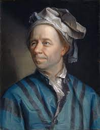

# Wykład 01: 02.03.22 - Matematyka na przełomie XVII i XVIII w., spojrzenie z dystansu

Tagi: wiek XVII, bernoulli, spor o matematyke, de l'hospital

## Wstęp

W trakcie XVII rozpoczął się dynamiczny rozwój matematyki. Porównać go można z przełomem koperńikańskim. Trwa ośiwecenie. Rozwijają się:

- geometria analityczna (poziom "ponadlicealny");
- rachunek różniczkowy;
- rachunek całkowy;
- statystyka;

## Ważne posataci i zasługi

- Isaac Newton: rachunek całkowy;
- Gottfried W. Leibniz;
- Michel Rolle: twierdzenie Rolle'a;
- Guillaume de l'Hospital: reguła de l'Hospitala;
- Abraham de Moivre: wzory de Moivre'a;
- Brook Taylor: szeregi Taylora;
- Christian Goldbach: hipoteza Goldbacha;
- James Stirling: wzór Stirlinga przybliżający silnię;
- Gabriel Cramer: wzory Cramer'a do rozwiązywaniarównań liniowych;

## W skrócie

- Pojawia się wiele uczelni inżynierskich oraz wojskowych.
- Migracja z powodu prześladowań na tle religijnym.
- Wielu monarchów i magnatów oferuje uczonym pozycje na swoich dworach.

## Co się dzieje i gdzie?

- Wielka Brytania
  - Następcy Wallisa i Newtona;
  - Uniwersytety Oxford, Cambridge, Edynburg, Glasgow;
  - Matematyka stosowana;
  - Zwalnia na koniec XVII w.;
  - Stirling, de Moivre, Taylor;

- Francja
  - Prężnie rozwija się w trakcie Oświecenia;
  - Akademia Francuska;
  - Uczniowie Kartezjusza;
  - Roll, de l'Hospital;
  - Zaskakująco dużo matematyków "z ludu". Wiedza stanowi drogę do pozycji społecznej;

- Niemcy
  - Po wojnie 30-letniej nic ciekawego się nie dzieje;
  - Trochę rachowania w Hamburgu, trochę astronomii w Norymberdze;

- Szwajcaria
  - Klan Bernoullich, Cramer;
  - Bazylea, Genewa;
  - Neutralność polityczna i światopoglądowa sprzyja rozwojowi nauki;

- Poza tym
  - W Skandynawii nic się nie dzieje;
  - We włoszech: uczniowie Galileusza w Padwie (ale nie dużo)

## Działy matematyki

- (Nowość!) Rachunek różniczkowy i całkowy;
  - Newton i Leibniz;
- Rachunek wariacyjny, rachunek prawdopodobieństwa, statystyka;
  - Bernoulli(todo: który), Newton, de Moivre;
- Geometria analityczna;
- Algebra jest troszkę w tyle;
  - kłopoty z liczbami ujemnymi i abstrakcją;

## Klan Bernoullich

### Nicholaus Bernoulli (1623 - 1708)

Jego ojciec (Jakub Bernoulli) ciekł z Niderlandów do Bazylei w 1622. Nicholaus odziedziczył biznes handlowy po ojcu. Ożenił się z córką bankiera (12 dzieci). Był radnym w Bazylei.

### Hieronymous Bernoulli (1669-1760)

Odziedziczył biznes po Nicholausie.

### Nicholaus (zwany starszym) Bernoulli (1662 - 1715)

Malarz portretowy, radny Bazylei.

### Jacob Bernoulli (1654 - 1704)

Studiował w Bazylei języki, filozofię, teologię. Bazylea nie była jeszcze dobrym miejscem do studiowania nauk ścisłych.

Wyjechał po studiach do Genewy. Pracował jako prywatny nauczyciel. W końcu wylądował w Paryżu, gdzie poznał dzieła Kartezjusza. Potem Holandia, Anglia (Royal Society, Hook). Wtedy też zaczął publikować prace (teoria na temat powstawania komet, badanie masy eteru).

Wrócił do Bazylei, ożenił się i objął katedrę matematyki (podobno źle zarabiał).
Osiągnięcia:

- Ars Conjectandi - Sztuka Przewidywania(wydane 1713);
  - Wartość oczekiwana;
  - Rozkład dwumianowy;
  - Prawo wielkich liczb;
- Bada wartość procentu składanego, szeregi nieskończone (suma odwrotności kwadratów liczb naturalnych jest znana jako problem Bazylejski);
- Jako pierwszy zauważył stałą *e*;
- Problem izochromy;
- Rachunek prawdopodobieństwa (rozkład Bernoulliego);
- Prawo wielkich liczb;

### Johann Bernoulli (1667 - 1748)

Studiuje medycynę na uniwersytecie w Bazylei. Jedzie do Genewy i Paryża, gdzie wykłada swoją interpretację prac Leibniza. Spotyka de l'Hospitala, który zostaje jego (todo: słowo na filantropię w ośiweceniu). Wraca na jakiś czas do Bazylei, potem wyjeżdża na jakiś czas do Groningen.

Osiągnięcia:

- Problem krzywej łańcuchowej;
- Na podstawie jego wykładów de l'Hospital wydał pierwszy duży podręcznik do rachunku różniczkowego i całkowego;
- Badał zagadnienie brachistochromy, zagadnienie izoperymetryczne;
- *Hydraulica*; Podstawy hydrodynamiki;

### Nicholaus I Bernouli (1687 - 1759)

Doktorat w Bazylei z zastosowań prawdopodobieństwa w sądownictwie. Wyjechał na jakiś czas do Padwy, ale po kilku latach wrócił do Bazylei, gdzie objął katedrę logiki. Mało publikował, dużo korespondował.

Osiągnięcia:

- Rozwiązał problem Bazylejski (chwilę po Eulerze, ale za to elegancko i prosto);
- Skompletował prace Jacob'a Bernoulli'ego i wydał je w *Opera Omnia*;

### Nicholaus II Bernouli (1695 - 1726) oraz Daniel Bernouli (1700 - 1782)

Podróżowali po Francji, dostali obaj zaproszenie do Petersburgu do Akademi Carskiej.

Osiągnięcia Daniela (bo Nicholaus II zmarł tuż po przyjeździe do Petersurbu):

- Metoda pomiaru ciśnienia krwi;
- Klepsydry żyroskopowe;
- Współpraca z Eulerem;
- Hydrodynamica 1738; prawo Bernoulliego;
- Wykłada biologię, fizykę;
- 10 razy zdobył nagrodę akademii Paryskiej;
- Kinetyczna teoria gazów;
- Badanie elastyczności;
- Pierwszy zaczął stosować statystykę do zagadnień demograficznych;

### Ciekawostki

Pierrer Currie był potomkiem Bernoullich.

### Guillaume Francois de l'Hospital (1331-1704)

Francuski arystokrata. Płacił stałą pensję Johann'owi Bernoullie'mu za wyłącznośc do jego prac naukowych.

Na podstawie tych prac wydał w 1696 *Analiza nieskończenie małych*.
Był to pierwszy podręcznik rachunku różniczkowego i całkowego.
W dodatku napisany jasno i klarownie.

Po jego śmierci Johann Bernoulli zaczął (dość nieporadnie) zgłaszać pretensje do swoich wyników.

### Michel Rolle (1652 - 1719)

Przeciwnik rachunku różniczkowego i całkowego. Jego kontrprzykłady pogłębiły zrozumienie i przyspieszyły rozwój tychże działów matematyki.

Osiągnięcia:

- *Traite d'Algebre* 1690; pierwsze pojawienie algorytmu eliminacji Gausse'a;
- *O nowym systemie nieskończoności* 1703; Krytyka Leibniza;

### Abraham de Moivre (1667 - 1754)

Po studiach we Francji po odwołaniu edyktu nantejskiego trafił do więzienia na 2-3 lata. Po odzyskaniu wolności wyjechał do Londynu, gdzie zaprzyjaźnił się z Newtonem. Nie mógł znaleźć stałego zatrudnienia na żadnej uczelni. Utrzymywał się z prywatnych lekcji.

Dokonania:

- Korekta optyki Newtona;
- Newton zapytany o jakieś szczegóły z *Principia*:
"*Idźcie do pana de Moivre'a, on to umie lepiej ode mnie.*"
- *The Doctrine of Chances* 1718; Podwaliny statystyki i rachunku prawdopodobieństwa;

### Brook Taylor (1685 - 1731)

Sekretarz Royal Society po Newtonie.

Dokonania:

- *Methodus Incrementorum Directa
& Inversa*; wzór Taylora

### James Stirling (1692 - 1770)

todo: (?) nic o nim nie powiedzieli

### Christian Goldbach (1690 - 1764)

Pochodził z Krulewca. Korespondował z Leibnizem, Bernoullimi i Eulerem. Był nauczycielem cara Piotra II.

Dokonania:

- Teoria liczb;
- Szeregi liczbowe;
- Hipoteza Goldbacha;

### Gabriel Cramer (1704 - 1752)

Bardzo ceniony uczeń Johann'a Bernoulli'ego.

Dokonania:

- Wzory Cramera;
- Opracował i wydał *Opera Omnia* Johann'a Berrnouli'ego

### Georges-Louis Levlerc de Buffon (1707 - 1788)

Przyrodnik, intendent we Francuskich ogrodach królewskich, członek Akademii Francuskiej.

Osiągnięcia:

- Autor zadania o igle ze statystyki; pozwala eksperymentalnie wyznaczyć wartość liczby $\pi$;

## "Spór o nieskończenie małe", czyli jak matematyka przestała być dobrze uporządkowaną nauką

Trudno to ładniej napisać niż jest w cytatach na prezentacji. W skrócie:

Pprzejścia graniczne były zupełnie nieuporządkowane. Symbol dx czasem był równy 0, czasem nie był. Słabe definicje prowadziły do słabych dowodów i fałszywych twierdzeń.

Wyniknął z tego spór miedzy matematykami o to czy wielkości nieskończone i nieskończenie małe istnieją czy nie.

Leibniz w tym sporze zajmował dość neutralną pozycję. Niemal musnął definicje typu $\epsilon$, $\delta$ (które w wykonaniu Weiertrass'a zformalizowały analize matematyczną).

Rolle był zdecydowanym przeciwnikime rachunku różniczkowego. Wymyślając kontrprzykłady znacznie przyczynił się do jego zrozumienia i rozwoju.

Spór o nieskończenie małe jest przykładem tego, że przełomy w matematyce są często przyjmowane z trudem.

## Podsumowanie

XVII wiek to moment, w którym zaczyna się współczesna matematyka.

# Wykład 02: 09.03.22-Euler i inni. Analiza i mechanika w XVIII wieku

## Wiek XVII. Rewolucja naukowa

Współpraca Akademii Naukowych: Paryż, Londyn, Berlin, Petersburg, Sztokholm, ...

### Międzynarodowy projekt zbadania kształtu ziemi (Francja, Hiszpania)

- Wyprawa do Laponii 1736-37, Pierre Louis Maupertuis
- Wyprawado Ekwadoru, 1735-44, Charles Marie de La Condamine

Celem wypraw było określenie kształtu ziemi poprzez porównanier długości południków.

### Międzynarodowy projekt zbadania odległości Słońca od Ziemi
  
Odległość tą da się zbadać, poprzez porównanie czasu przejścia Wenus przez tarczę słoneczną, obserwowanego z różnych miejsc na ziemi. Do przedsięwzięcia rękę przyłożyło setki naukowców z różnych krajów.

Warto zwrócić uwagę, że kiedy Anglia była w stanie wojny z Francją ich ekspedycje naukowe prowadziły wspólny projekt.

- Sponsorzy:

  Król Ludwik XV, królowie Jerzy II i III, caryca Katarzyna Wielka, królowa Luiza Ulryka, król Carlos III, ...

  Podobno Ludwik XV był wielce zainteresowany nauką.

- Badacze:

  Benjamin Franklin, Michał Łomonosow, James Cook, ..., setki obserwatorów

Pierwsza próba w 1761 zakończyła się niepowodzeniem.

Druga próba w 1769 zakończyła się sukcesem. (Wg wykładu kilkaset tysięcy kilometrów błędu. Wg wikipedii ~1.2 mln km błędu. Około 0.8%.)

Wielu naukowców w ramach tych wypraw sporządziło dokładne jak na tamte czasy mapy ziemi.

## Rozwój matematyki

- Analiza matematyczna;
- Równania różniczkowe zwyczajne; Mechanika klasyczna, $m\ddot{x}=F$ (ten wzór pierwszy raz widziany u Eulera);
- Równania różniczkowe cząstkowe; Rozchodzenie się ciepła;
- Mechanika płynów; Równania Eulera;
- Rachunek wariacyjny; Mechanika Lagrange'a;
- Uzasadnienie podstaw rahunku różniczkowego;

## Daniel Bernoulli

- Groningen, 1700

  - Studia medyczne w Wenecji;
  - Matematyka jako dodatek;

Przemieścił się do Petersburgu ponieważ lepiej tam płacili.

- Petersburg, 1725 - 1733

  - Prowadził wykłady min. z fizyki;
  - Współpracował z Eulerem na wydziale matematyki;
  - Poza tym hydrodynamika, prawdopodobieństwo;

Wyjechał z Rosji z powodów bezpieczeństwa. (Za "nie takie jak trzeba" opinie łatwo było stracić głowę.)

- Bazylea, 1734

  - Dalsza współpraca z Eulerem;
  - *Hydrodynamica* 1738; Metoda pomiaru ciśnienia płynu;
  - $\frac{v^2}2+\frac{p}{\rho}+gz = const$; równanie Bernoulliego
  - Poza tym akustyka, astronomia, nautyka, magnetyzm;

### Leonard Euler (1707 - 1783)

Jest odpowiedzialny za 3/4 matematyki XVIII wieku. Był najbardziej płodnym matematykiem wszechczasów.

Zajmował się: astronomią, teorią liczb, topologią, hydrodynamiką, analizą matematyczną.

#### Biografia

- Bazylea, 17007 - 1727
  - Nauka u Johanna Bernoulli’ego

W 1725 został zaproszony do Petersburgu.

- Petersburg, 1727–1741
  - Wydział Matematyki
  - Współpraca z Danielem Bernoulli

Wyjazd z Petersburgu z powodów bezpieczeństwa.

- Berlin, 1746–1766
  - Fryderyk Wielki
  - Od 1735 pogorszenie się wzroku, ”cyklop”. Później oślepł całkowicie. Większość pracy związanej z matematyką już jako osoba niewidoma.

Został poniekąt wyrzucony z Berlina, ponieważ był zbyt mało liberalny na tle religijno-towarzyskim dla Fryderyka Wielkiego. Dosatł zaproszenie od Katarzyny Wielkiej.

- Petersburg, 1766–1783
  - Katarzyna Wielka

### Matematyka Eulerowska

- "*Podążaj za formułami, a one doprowadzą cię do prawdy*" (L. Euler)

  Euler zazwyczaj nie zastanawiał się czy jakąś operację można wykonać (np. operacje na seregach nieskończonych), tylko wykonywał ją i patrzył gdzie go doprowadzi.

  Należy być śmiałym, brać pomysły z fizyki, wykonywać obliczenia, a potem uzasadniać dlaczego wyniki mają sens.

- Przy rozwinięć funkcji trygonometrycznych w szereg pokazał $\sum_{n=1}^\infty\frac1{n^2}=\frac{\pi^2}{6}$

  Wynik sprawdził ręcznie obliczając sumę częściową szeregu.
- Pokazał $\sum_{n=1}^\infty n = -\frac1{12}$

  Wynik ten ma zastosowania w kwantowej teorii pola. Jest potwierdzony eksperymentalnie.

Gdyby grecy wystaszyli się liczb niewymiernych (np. przekątnej kwadratu), ale nie chcieliby o nich słyszeć matematyka doznałaby zastoju.

Analogicznie Euler nie wystraszył się swoich wyników.

(To z wykładu cytat.)

### Słynne monografie Eulera z analizy matematycznej

- "*Wstęp do Analizy Nieskończoności*", 1747;

  - zdefiniowała współczesny język analizy;
  - definicja funkcji, szeregu, ...;
  - liczby $\pi$, $e$;
  - definicje $\cos$ i $\sin$;
  - wzór Eulera $\cos x + i\sin x = e^{ix}$;

- "*Rachunek Różniczkowy*", 1755;
- "*Rachunek Całkowy*", 1770;

### Euler dodatki

- $e^{ix} = \cos x + i\sin x$

  Dla $x = \pi$:  
  
  $e^{i\pi}+1=0$

  Jest to jeden z popularniejszych wzorów obok:

  $E = mc^2$ i $(i{\partial} - m)\psi = 0$ ($\partial$ powinno być kreślone ale .md nie umie)

- Równania Eulera płynu o stałej gęstości $\rho$ stanowią relację pomiędzy działającą siłą f, prędkością u i ciśnieniem płynu p.

  $\frac{\partial u}{\partial t} + (u\cdot \triangledown u) = -\frac1\rho\triangledown p+f$ (lewa strona to przyśpieszenie, prawa to siła dzielona przez masę)

  $\text{div }u = 0$ (To oznacza, że $\rho = const$)

### Joseph Louis Lagrange (1736 - 1813)

#### Biografia

- Turyn, 1736-1766
  - Towarzystwo naukowe;
- Berlin, 1766-1787
  - Fryderyk Wielki;
  - "*M´ecanique analytique*", astronomia;
- Paryż 1787-1813
  - Rewolucja francuska, 1789-1799 (nie mieszał się w politykę, więc uniknął gilotyny)
  - system metryczny;
  - Wkład w prawie każdą dziedzinę matematyki, mechanika, astronomia;

Cytat z wykładu który zdecydowałem się tutaj zamieścić:

*Imperia piszą historię, ale dzisiaj pisze sie coraz więcej prawdy.*

### "*M´ecanique analytique*", 1788

- Mechanika wyrażona czysto
analitycznie jako elegancka
teoria;
- Zawiera mechanikę Newtona;
- Nie ma żadnego wykresu;
- Zasada najmniejszego
działania, L = T − U (L = energia kinetyczna - energia potencjalna)

- Równanie Lagrange'a

  $\frac d{dt}\frac{\partial L}{\partial \dot q} - \frac{\partial L}{\partial q} = 0$

  jest uniwersalne w fizyce współczesnej.

  Zastosowanie min. w teorii kwantów.

Od mechaniki Lagrange'a pochodzi mechanika Hamilton'a, która jest jeszcze bardziej elegancka.

### Przykłady zagadnień rozpatrywanych przez Lagrange'a

#### Problem trzech ciał. Punkt Lagrange'a

W przestrzeni znajdują się 3 ciała. Znamy ich masy i początkowe prędkości. Należy obliczyć trajektorie.

Otóż zazwyczaj się nie da.

Jeśli jedno z ciał ma pomijalną masę (np. satelita w układzie ziemia-słońce) to problem da się rozwiązać.

- W punkcie $L_1$ znajduje się obserwatorium SOHO.
  
  Badanie:
  - Wewnętrznej struktury Słońca;
  - Zjawisk na powierzchni słońca;
  - Wiatru słonecznego, jego wpływu na Ziemię;

- W punkcie $L_2$ zaparkował kilka miesięcy temu Kosmiczy Teleskop Jamesa Webba.
  - Obserwacje w podczerwieni;
  - Uzupełnienie teleskopu Hubble’a;
  - Badanie powstawania gwiazd i systemów planetarnych;
  - Badanie formowania się i ewolucji galaktyk;
  - Obserwacje pierwszych gwiazd powstałych po Wielkim Wybuchu;

# Wykład 03: 06.03.22 Rozwój algebry w XIX wieku (M. Skałba)

## Przełom XVIII i XIX wieku (Gauss)

### "Disquisitiones Arithmeticae" (Carl Friedrich Gauss, 1801)
Najbardziej wpływowa książka z teorii liczb i algebry napisana przez Gaussa w wieku 21 lat. Ukazała się z kilkuletnim opóźnieniem z powodu trudności odwzrorowania skomplikowanych wzorów na maszynie drukarskiej. Gauss zajmuje się dziedzinami z teorii grup, której jeszcze nie było w matematyce.

Wprowadza pojęcie *kongruencji mod m* w sposób ścisły i ogólny, staje się to ważnym impulsem do rozwoju algebry, ponieważ było przykładem relacji równoważności, które respektują działania arytmetyczne.

Niech $p$ - dowolna liczba naturalna, którą daje się przedstawić jako:
$p = x^2 + 6y^2$, a $n$ niech oznacza liczbę w postaci $n = 2x^2 + 3y^2$.

Następujące tożsamości obowiązują:
$$ (x^2 + 6y^2)(z^2 + 6 t^2) = (xz - 6yt)^2 + 6(xt + yz)^2$$
- Iloczyn dwóch liczb typu $p$ daje liczbę typu $p$.

- Podobnie iloczyn liczby typu $p$ i $n$ daje liczbę typu $n$. 
- A iloczyn $n$ i $n$ daje liczbę $p$. 

Takie proste reguły dają początek teorii grup i nowoczesnej algebrze w XIX wieku, jako nauka o **strukturach algebraicznych** (np. grupach), a nie o rozwiązywaniu równań.

### Prawo wzajemności dla reszt kwadratowych Gaussa

*Das quadratische Reziprozitaetsgesetz* po Niemiecku. Orzeka ono:

*Rozważmy dwie różne liczby nieparzyste $p$, $q$ oraz następujące dwie konkruencje:*
$$ x^2 \equiv q \mod p\qquad x^2 \equiv p \mod q$$
*Wówczas każda z tych kongruencji ma rozwiązanie x albo żadna nie ma rozwiązań,* **chyba, że** $p \equiv q \equiv 3 \mod 4$: *wówczas jedna z nich ma rozwiązanie, a druga nie.* Pierwszy dowód podał Gauss (a potem 5 istotnie innych). Dziś opublikowano >150 różnych dowodów PWRK Gaussa! Dowód jest punktem wyjścia do rozwoju **algebraicznej teorii liczb**.

### Zasadnicze tw. algebry
Każde równanie o współczynnikach zespolonych ma przynajmniej jeden pierwiastek zespolony - Gauss udowondił jako pierwszy w 1799 r.

## Rozwiązywanie równań, czyli teoria Galois

Norweg **Niels Henrik Abel** (1802 - 1829) zrobił pierwszy ważny postęp w rozwiązywaniu równań wielomianowych po renesansowych wyczynach Włochów. Pokazał, że nie ma uniwersalnych wzorów literowych na pierwiastki wielomianów stopnia 5. Pierwszy dowód, że czegoś nie da się zrobić (**Paolo Ruffini** wcześniej uzyskał ten wynik, ale nie został uznany przez środowisko matem.). Ale nie wiadomo, czy nie różnych wzorów w zależności od przypadku.

### Evariste Galois

Udowodnił, że nie da się zapisać pierwiastków równania 5. stopnia z użyciem działań arytmetycznych na współczynnikach i operacji wyciągania pierwiastków, jeśli **grupa Gaolis** wielomianu nie jest *szczególna*. Wykorzystał do tego teorię grup, którą stworzył. Te *szczególne* grupy, kiedy istnieją rozwiązania, nazywa się **grupami rozwiązalnymi**. Skałba poleca książkę *Wybrańcy bogów* Leopolda Infelda o E. Galois.

**Ważne osiągnięcie - pewnych równań nie da się rozwiązać!**

## Dirichlet

P. Lejeune-Dirichlet (1805 - 1859) matematyk niemiecki francuskiego pochodzenia. W swoim dowodzie twierdzenia o liczbach pierwszych w postępie arytmetycznym użył grupy charakterów zredukowanej grupy reszt mod m. Ten dowód to początek analitycznej teorii liczb i teorię reprezentacji grup.

### Charaktery Dirichleta mod 4

Rozważmy funkcję $n: Z \to \{-1,0,1\}$ oraz  $p: Z \to \{-1,0,1\}$:
$$n(4k+1) = 1, \ n(4k+3) = -1,\, n(4k) = n(4k) = 0$$
$$p(4k+1) = 1, \,p(4k+3) = 1,\, n(4k) = n(4k) = 0$$
Funkcja $n$ zachowuje się dobrze przy mnożeniu.
Są tu grupy grupy cyklicznej dwuelementowej. Dirichlet pokazał, że jest nieskończenie wiele liczby pierwszych typów $4k+3$ oraz $4k+1$ (przez pokazanie, że *szereg ich odwrotności jest rozbieżny*). Przez to Dirichlet staje się ojcem analitycznej teorii liczb. 

## Kummer: Wielkie Twierdzenie Fermata i Wyższe Prawa Wzajemności

Eduard Kummer interesował się *WTF* (w przeciwieństwie do Dirichleta) i udowodnił jest dla szerokiej klasy wykłodników. Niec doszedł jednak do pojęcia *ideału* (zrobił'to później *R. Dedekind*).

Niech $\mathbb{Z}[i]$ będzie zbiorem liczb zespolonych w postaci $a+ bi,\, a,b \in \mathbb{Z}$. Jeśli liczba $(a+bi)/(1+i)$ też należy do $\mathbb{Z}[i]$ to możemy roboczo liczbę $a+bi$ nazywać parzystą. Ponieważ $(1+i)^2 = 2i$, więc liczba 2 jest teraz podwójnie parzysta (jest odpowiednikiem liczby całkowitej podzielnej przez 4). Kummer umiał przeprowadzić tego typu konstrukcję w dowolnym zbiorze typu $\mathbb{Z}[\omega]$, gdzie $\omega$ jest ustalonym pierwiastkiem z 1 a $p$ dowolną liczbą pierwszą (w naszym przykładzie p = 2 a $\omega$ = i, czyli pierwiastek z 1 czwartego stopnia.) W pierścieniach $\mathbb{Z}[\omega]$ na ogół nie ma jednoznaczności rozkładu na
czynniki pierwsze i dlatego Kummer rozważał tzw. **liczby idealne**. W naszym przypadku $\mathbb{Z}[\omega]$ mamy jednoznaczność rozkładu i dla p = 2 wzięliśmy zwykłą liczbę 1 + i. To wszystko potrzebne do udowodnienia wielkiego twierdzenia Fermata dla wielu przypadków.

Kummer interesował się intensywniej Wyższymi Prawami Wzajemności.

### Bikwadratowe prawo wzajemności

Bikwadratowe prawo wzajemności, czyli twierdzenie dotyczące kongruencji:
$$x^4 \equiv q \mod p$$
wymaga uogólnienia symbolu Legendre’a dla reszt kwadratowych.
Najprościej rzecz ujmując teraz nie ma dychotomi typu: reszta kwadratowa
(R) a niereszta kwadratowa (N) i brak najprostszych praw rachunkowych
typu: N × N = R, N × R = N . . .. Tym razem na wykładnikach
obowiązuje rachunek mod 4: są trzy rodzaje niereszt bikwadratowych (gdyż
są cztery niezerowe reszty mod 4: 1,2,3). Poniważ jednak chcemy, aby
bikwadratowy symbol Legendre’a był multyplikatywny, więc przyjmuje on
wartości ze zbioru {1, i, −1, −i}, który jest grupą cykliczną rzędu 4,
podobnie jak reszty {0, 1, 2, 3} z dodawaniem reszt mod 4. Tak więc już
pojawia się praktyczna konieczność rachunków w $\mathbb{Z}[\omega]$ – zwanym
pierścieniem Gaussa, który pierwszy zauważył, że aby badać reszty
bikwadratowe, trzeba koniecznie wyjść poza zwykłe liczby całkowite.

## Początki algebry liniowej i nieprzemiennej

**Hermann Grassmann** w Niemczech tzn.najpierw w Szczecinie, gdzie był
nauczycielem a potem w Berlinie, gdzie był profesorem, stworzył pierwsze
podstawy teorii **przestrzeni wektorowych**. Zrozumiał podstawowe
znaczenie pojęć liniowej niezależności i generowania podprzestrzeni przez
układ wektorów. Był zadowolony z możliwości uprawiania geometrii
niezależnie od **wymiaru** przestrzeni! Wprowadził pojęcie bazy, wymiaru przestrzeni, wektorów niezależnych.

Grassman napisał podręcznik w tak abstrakcyjny i współczesny sposób, że ówcześni matematycy nie potrafili docenić jego matematematycznego geniuszu, ponieważ byli przyzwyczajeni do algebry w postaci np. kwaternionów. W swoich czasach był bardziej ceniony jako językoznawca.

**William Hamilton** w Irlandii stworzył **kwaterniony**. Są to czterowymiarowe wyrażenia $a + bi + cj + dk$, gdzie
$a, b, c, d ∈ \mathbb{R}\, a, i, j, k$ są specjalnymi symbolami, które mnoży się następująco (deklarujemy):
$$ii = jj = kk = −1, ij = k, jk = i, ki = j, ji = −k, kj = −i, ik = −j$$

Zatem mnożenie tych symboli nie jest przemienne, czyli wyrażeń $a + bi + cj + dk$ również. Zwykły liczby $a,b,c,d$ są przemienne ze wszystkim. Zbiór kwaternionów jest pierwszym przykładem **ciała nieprzemiennego**, czyli struktury algebraicznej, gdzie wykonalne są cztery działa arytmetyczne (również dzielenie da się), ale mnożenie nie jest przemienne. W procesie uogólniania pojęcia liczby kwaterniony są najbliższym kuzynem liczb zespolonych – trójek liczb nie da się sensownie mnożyć (Frobenius). Problemem było mnożenie wektorów trzywymiarowych - ludzie nie wiedzieli jak to robić. Hamiltonowi nie udało się tego zrobić, ale trochę pomógł w mnożeniu wektorów czterowymiarowych. Kwaterniony też są pierwszym przykładem algebry centralnej.

## Rozwój teorii grup

Zasłużeni dla rozwoju teorii grup w 19 wieku matematycy to na pewno A.
Cayley i F. Klein. Wcześniej pojęcie grupy nie pojawiło się *explicite*, jako pojęcie abstrakcyjne. **A. Cayley** pierwszy podał aksomaty grupy, ale
jednocześnie udowodnił swoje słynne twierdzenie o reprezentacji: *każda
grupa może być traktowana jako grupa permutacji pewnego zbioru*. Łatwo je udowodnić, ale filozoficzne jest słabe, ponieważ niektórzy uważali, że pojęcie grupy nie jest przez to potrzebne (zbyt abstrakcyjne).

Natomiast **F. Klein** znalazł spektakularne zastosowania pojęcia grupy w
geometrii jako takiej. Mianowicie zdefiniował geometrię jako teorię
niezmienników pewnej grupy przekształceń. W geometrii szkolnej płaszczyzny najważnie pojęcia to mierzenie odległości i pól, a te pojęcia są niezmiennikami izometrii. Jako grupę weźmę grupę wszystkich izometrii (MD xd).

Niech $G_1=\{1,2,3,4\}$, przy czym działaniem jest modulo 5. Natomiast niech $G_2=\{1,3,5,7\}$ tym razem działanie to mnożenie modulo 8.W grupie G1 potęgi elementu 2 to: 2, 4, 8 = 3, 6 = 1 dają wszystkie elementy G1. Natomiast potęgi dowlnego elementu $g \in G_2$ dają
tylko $g, 1$. Obie grupy mają po 4 elementy, ale są algebraicznie różne: $G_1$
jest cykliczna , a $G_2$ to czwórkowa grupa Kleina.

## Koniec 19. wieku – twierdzenia Hilberta

Jak rozwój geometrii algebraicznej wpłynął na rozwój algebry abstrakcyjnej.

Jeśli w układzie równań liniowych można tak pododawać równania stronami
(wcześniej mnożąc obie strony tych równań przez liczby 6= 0) aby otrzymać
równanie ewidentnie sprzeczne: $0 \cdot x_1 + 0 \cdot x_2 + ... + 0 \cdot x_n = 1$, to wyjściowy układ równań też nie ma żadnych rozwiązań. 

Jeśli uzyskanie tak ewidentnej sprzeczności nie jest możliwe to wyjściowy układ ma rozwiązania.

**Twierdzenia Hilberta o zerach** (Nullstellensatz) uogólnia to
następująco: *Dowolny układ równań wielomianowych (wielu zmiennych):*
$$f_1(x_1, . . . , x_n) = 0, f_2(x_1, . . . , x_n) = 0, . . . , f_k (x_1, . . . , x_n) = 0$$
*o współczynnikach z ciała liczb zespolonych nie ma rozwiązań tylko w
sytuacji, gdy istnieją wielomiany* $g_1, g_2, . . . , g_k$ *takie, że zachodzi tożsamość*
$$g_1f_1 + g_2f_2 + . . . + g_k f_k = 1.$$

Tylko w takiej sytuacji nie ma rozwiązań.

**Twierdzenie Hilberta o bazie**. Stwierdza ono w zasadzie, że każdy układ równań wielomianowych (również o nieskończenie wielu równaniach!) jest
równoważny układowi równań ze skończoną liczbą równań. Oba powyższe
twierdzenia wyniosły geometrię algebraiczną na istotnie wyższy poziom, niż
zostawili ją włoscy geometrzy algebraiczni 19. wieku. Twierdzenie to
zdetronizowało w pewnym sensie wiodącą **teorię niezmienników**.

# Wykład 04: 24.03.22 Aksjomatyzacja geometrii XVII - XIX w. (Danuta Ciesielska)

Czy jest tylko jeden możliwy opis (mierzenie) świata? Czy jest tylko jedna geometria? Wcześniej wierzono, że istnieje tylko geometria Euklidesowa. Porzadek prawie chronologiczny.

- geometria Euklidesowa
- geometria sferyczna - astronomia
- geometria wykreślna
- geometria rzutowa
- geometria nieeuklidesowa (hiperboliczna)
- geometria różniczkowa 
- geometria algebraiczna

## Geometria rzutowa
Początki to badania nad perspektywą malarską. Ookło 1420 Filippo Brunelleschi (1377-1446) namalował pierwszy obraz, w którym widać perspektywę malarską:

Podstawy nauki (rzemieślniczej) malarskiej perspektywie dał **Leon Battista Alberti**(1404-1472) w książce o zasadach malarskich (*Della pittura*), zaprezentował tam metodę z użyciem ramy i siatki, ułatwiająca zadanie przekształcenia widzianego obiektu przestrzennego na płaską powierzchnię.

Albertiemu zawdzięczamiy podstawowe zasady perspektywy:
- linie proste pozostają prostymi
- linie równoległe albo pozostają takimi, albo przecinają się w jednym (niedostępnym, znikającym) punkcie.

Alberti jako pierwszy zauważył, że proponowane przez niego przekształcenie nie zachowuje ani kątów, ani **proporcji** (w przeciwieństwie do wcześniejszych malarzy). Dlatego ta geometria jest inna niż euklidesowa.

Metodę zaproponowaną przez Albertiego rozwinął **Albrecht Durer**(471-1528).

Zaburzenie proporcji nie zgadzało się z Elementami Euklidesa.

Do rozwoju przyczynili się kolejni artyści 
-**Leonardo da Vinci**:  pierwszy anamorficzny rysunek (Codex Atlanticus), anamorficzny czyli zniekształcony za pomocą odpowietniego rzutowania
-**Niceron** krzesło Nicerona, koncepcja rzutu (projekcji), ogólniejsze niż perspektywa.

Koncepcja geometrii opartej na koncepcji rzutu nie była spójna z panującą koncepcją geometrii Euklidesowej.

Pierwsze teoretycznie podstawy dał **Girard Desargues** (architekt) "Pierwszy zarys badania zjawisk, jakie zachodzą przy spotkaniu stożka z płaszczyzną", 1639. Rozważa w nim cień okręgu oświetlonego przez mocne punktowe źródło światła i zauważa, że może on przyjąć kształt krzywej stożkowej (elipsa, parabola, hiperbola). W dziele tym pojawiły się zasadnicze twierdzeniea geometrii rzutowej, w szczególności twierdzenie noszące dziś imię Desarguesa. *O dwóch trójkątach współkreślnych* (https://pl.wikipedia.org/wiki/Twierdzenie_Desargues%E2%80%99a).

### Johaness Kepler (1571-1630)
wprowadził pojęcie punktu w nieskończoności. Keplera inspirowaly badania **Witelona** (1230-1280) na temat optyki i anatomii widzenia. Postulat, że każde proste równoległe przecinają się w punkcie leżącym w  "nieskończoności". Desargues wykorzystał (ten fakt) do klasifikacji krzywych stożkowych (liczba punktów w nieskończoności, 2 - hiperbola, 1 - parabola, 0 - elipsa). 

Ideę tę widać u **Isaaa Newtona**, który w 1695 roku opracował klasyfikację krzywych stopnia trzeciego (*Lexicon Technicum* John Lexicon). Desargues i Kepler zauważyli, że punkt w nieskończoności domyka każðą linię do okręgu o nieskończonym promieniu - jak przetniemy prostą na pół to pozostaje w jednym kawałku. Była to pierwsza obserwacja, że topologiczny charakter "prostych rzutowych" jest odmienny od "prostych euklidesowych". Desargues wprowadził dla czterech współliniowych punktów $P, A, B, Q$ pojęcie dwustosunku $\frac{\frac{AQ}{BQ}}{\frac{AP}{BP}}$, jak się okazało kluczowe w tej geometrii.

Najważniejsze  jednak tw. **Blaisa Pascala** (1623-1662):

Jeżeli mamy krzywą stożkową (tutaj okrąg) i wpisany jest tam szcześciokąt, to punkty przecięcia odpowiednich boków (branych cyklicznie co 3), to są trzy punkty są współliniowe.
Inne osoby, które przyczyniły się do geometrii rzutowej:
- Jean-Victor Poncelet (1788-1867) - absolwent politechniki  francuskiej wcielony do wojska w wojnach Napoleońskich, więziony przez Rosjan, którzy zaproponowali mu, żeby wykładał geometrę wykreślną. Nie miał podręczników, więc wymyślił trochę inną geometrię: nie wykreślną, a rzutową.
- August Ferdinand Mobius (1790-1868) - wprowadzili układ współrzędnych: metoda barycentryczna. Jest to sposób opisania środka ciężkości trójkąta i gdzie punkty znajdują się w stosunku do tego środka.
- Julius Plucker (1801-1868) - badamy obiekty, a nie punkty, pierwsze zastosowania macierzy.
- Karl Georg Christian von Staudt (1798-1867) - rozwinął aksjomatykę, szczególnie zastosowań np. konstrukcja stycznej do okręgu z dowolnego punktu z wykorzystaniem samej linijki.
- Felix Klein (1849-1925) - rozwinął już geometrię z aksjomatyką i współrzędnymi, ale nie potrafiono mierzyć odległości.

Metryka Kleina: punkty $A,B$ leżące wewnątrz koła na cięciwie o końcach $P, Q$ są odległe o $\ln\frac{AQ\cdot BP}{AP\cdot BQ}$. Pokazuje ona, że odległość punktów mimo określenia nia czymś skończonym (cięciwa koła) może mieć wartość nieskończone.

## Geometria Euklidesowska
"Elementy" Euklides. Dzieło to stanowi wzór metody aksjomatycznej. 

Koncepcja prostej: to obiekt, który może być dowolnie rozszerzany, nie jest skończony. Elementy stały się podstawowym podręcznikiem geometrii (w szkołach). Jednak Rouse Ball twierdzi, że w ten sposób uzyskały nie zasłużoną sławę i narzuciły metodę. Jednak kontrowersje wzniecał ostatni, **aksjomat V**.

Walka z aksjomatem V:
- Najbardziej znanym komentatorem był **Proklos Diadochos** (410-485 n.e.) Był autorem *Komentarza do pierwszej księgi Euklidesa*. Dzieło to jest jednym z głównych źródeł, z których możemy wywnioskować o historii matematyki greckiej. Proklos uważał, że postulat V powinien być usunięty, gdyż jest twierdzeniem. Od Proklosa pochodzi "dowód" V postulatu. Zakłada w nim, że odległość między dwiema prostymi jest wielkokścią ograniczoną, co jest **równoważne** dowodzonemu aksjomatowi. Zatem proste nie przecinające się nie mogą się również dowolnie oddalać.

- **Thabit Ibn Qurra** (836-901) był autorem dwóch traktatów zawierających dowody V postulatu. W *Księdze o dowodzie znanego postulatu Euklidesa* opiera się on na założeniu, że jeśli dwie proste oddalają się jedna od drugiej z jednej strony, to muszą się zbliżać z przeciwnej. Bazuje on na metodzie dowodzowej wprowadzając pojęci ruchu. Zakłada jednak, że w takim ruchu wszystkie poruszające się punkty opisują linie proste, co jest równoważne V postulatowi.

- **Alhazen** (954 - 1039) *O rozwiązaniu wątpliwości w księdze Euklidesa 'Elementy'*, zakłada, że dwie przecinające proste nie mogą być równoległe do jednej prostej. **Hipoteza istnienia prostokąta**, jeśli ruch odbywa się po linii prostej to koniec odcinka prostopadłego do tej prostej, opisuje linię prostą, która jest równoodległa od danej. Ponownie, jak poprzednicy, dowodzi istnienia prostokąta. Zakłada prostokąt o 3 kątach prostych i rozważa trzy hipotezy, co do rozwartości czwartego kąta. Hipotezy kąta ostrego i rozwartego obala za pomocą V postulatu.

- **Omar Chajjam** poddał krytyce dowód Ibn al-Haithama. Stwierdził, że w geometrii niedopusczalne jest wprowadzenie ruchu. Sugerował zastąpienie aksjomatu równoległości innym aksjometem, jego zdaniem prostszym, ale ostatecznie równoważnym.
- **Nasir ad-Dina**
- Pierwsze "dowody" V postulatu w Europie podali **Leon Gersonides** oraz **Alfonso** (XV w.). Te same błędy
- **Christopher Schlussela**, też podał "dowód" opierając się na badaniach arabskich uczonych. Podał definicję prostej równoważną V. aksjomatowi.
- **Clavius** inne sformułowanie aksjomatu Euklidesa
Błogosławiony błąd, taki, który coś wnosi do nauki.
- **John Wallis** - aksjomat równoległości jest spełniony wtedy i tylko wtedy, gdy istnieją dwa podobne, ale nie przystające trójkąty.

## Początki geometrii nieeulkidesowej

**Girolamo Sacccherii (1667 - 1733)**
Włoski jezuita. Jak dopuścił możliwość, że dzieją się rzeczy nieprzewidywane, zastanowił się, do czego można dojść.  Badał na zasadzie *reductio ad absurdum*. Odkrył wiele twierdzeń geometrii nieuklidesowej (hiperbolicznej).

Opulikował pracę *Euklides oczyszczony z wczelkiej skazy...*. Przyjął 4 pierwsze postulaty i zamiast V. przyjął możliwość, że mogą te proste się nie przeciąć. Udowodnił 26 twierdzeń, postawił kilka tez. Udało się w czworokącie o 3. kątach prostych udowodnić, że czwarty kąt to nie jest kąt rozwarty. Udowodnił, że w zależności od tego, ile wynosi suma kątów w trójkącie jest >, < lub = od 180 stopni to mamy trzy różne geometrie.
- ">180" to sprzecznośc z tym, że prosta jest nieograniczona
- = 180 euklidesowa
- < 180, mogą się nieskończenie zbliżać, ale nie przeciąć.

 **Johan Heinrich Lambert (1728 - 1777)**, udowodnił twierdzenie, że nie istnieją figury podobne, ale nie przystające (w geom. nieeuklidesowej)

**Adrien-Marie Legendre (1752-1833)** wydał popularny podręcznik do geometrii w którym zawarł dowód V aksjomatu. W podręczniku znalazło się nieprawdziwe twierdzenie o sumie kątów w trójkącie, ale przez wiele lat ten podręcznik pozostawał w użyciu (12 wydań na 14 zawierało błąd). Ale udowodnił, że z aksjomatem Euklidesa jest równoważny inny oczywisty fakt.

**Ferdinand Karl Schweikart(1780-1857)** zniechęcony przez Gaussa zarzucił swoje badania.
**Franz Arnold Taurinus**, porzucił hipotezę kąta ostrego.

### Twórcy geometrii nieuklidesowej

**Farkas Bolyai** (1775 - 1856), z Rumunii, student uniwersytetu w Getyndze, gdzie poznał Gaussa. Rozważał niezależność V postulatu, konsultował swoje bania z Gaussem, ktory go zniechęcał. Wymyślił kolejną inną wersję aksjomatu Euklidesa.

**Nikołaj Iwanowicz Łobaczewski** (1792/93-1856) w 1826 opublikował pracę w którym wizja geometrii nieukl. jest spójna, wprowadza funkcję (Łobaczewskiego). Funkcja ta przyporządkowuje długośći odcinka miarę odpowiedniego kąta, zwanego kątem równoległości. Łobaczewski dowodzi, że kąt równoległości jest kątem ostrym oraz wartość funkcji wyraża się wzorem:
$$ \Pi(x) = \arcctg e^{\frac{x}{r}}$$
gdzie $r$ jest modułem promienia wprowadzonego przez Lamberta. Z własności tej funkcji wynika sporo własności tej geometrii. Praca stała się popularna później jak została wydana po niemiecku.

W podobnym czasie **Janos Bolyai**: ojciec pisał do syna: *Zaklinam cię, nie próbuj teorii równoległych,tracisz na to swój czas, a twierdzenia nie udowodnicie wszyscy razem*. Zdawał sobie sprawę, że nie dowodzi niczego, tylko tworzy nową geometrię. Praca została niezauważona, a Jonas przeżył załamanie nerwowe.

**Eugenio Beltrami** - twórca modeli geometrii nieeuklidesowej, na podstawie badań Bolayia-Łobaczewskiego. Inerpetacja geometrii na powierzchni o zakrzywieniu ujemnym jest poprawna (ale w pracy było brak obrazków).

**Felix Klein** - zaproponowany ma interpetację geometryczną. W pracy 1871 Klein pokaza, że geometrię nieeuklidesową pokazał jako gemoetrie rzutowe z odpowiednią metryką. Pokazał, że geometria Bolaya-Łobaczewskiego jest niesprzeczna.
Klein wyróżnia trzy geometrie: hiperboliczną, eliptyczną i paraboliczną. Kryterium podziału to charakter punktów prostej w nieskończoności. Te trzy gatunki geometrii to szczególne przypadki ogólnej metryki **Cayleya**.

## Aksjomatyzacja geometrii Euklidesowej
### David Hilbert (1862 - 1943)

Okazało się, że aksjomaty są niepełne. Opublikował w 1899 zestaw aksjomatów, podzielił je na pięć grup
- aksjomaty incydencji (8)- zależności, prosta przechodzi przez punkt itd.
- aksjomaty uporządkowania (4) - między dwoma punkty jest jedna prosta, dodany aksjomat Pascha)
- aksjomaty przystawania (5)
- aksjomat ciągłości (2, w tym aksjomat Archimedesa)
- aksjomaty równoległości (1)
Wzorzec geometrii Euklidesowej do dzisiaj.

**Karol Borsuk**, **Zofia Krygowska** - polski wkład.
Dzisiaj w szkole aksjomatyki się nie uczy, na studiach też się właściwe tych aksjomatów (około 20) też się nie uczy.

Aksjomatyka do wieku XVIII była wiodącą dziedziną metematyki, potem straciła prym na rzecz analizy i innych dziedzin.

# Wykład 05: 30.03.22 - Geometria i nie tylko

Tagi: geometria, rozmaitość, krzywizna, powierzchnia minimalna, helikoida, katenoida, Gauss, Euler, Schwarz, Weierstrass, Riemann, Lie, Klein

## Zminay w geometrii na początku XVIII

Dzięki rozwojowi geometrii analitycznej i rachunku różniczkowego dostaliśmy możliwość badania nowych krzywych i powierzchni.

Stopniowo rozwijane były nowe działy matematyki, w tym rachunek wariacyjny oraz fizyka.

## Kluczowe pojęcia współczesnej geometrii

- Rozmaitość
    - ogólnie: obiekt, który w małej skali w każdym miejscu wygląda jak fragment przestrzeni euklidesowej, ewentualnie lekko zdeformowany (zakrzywiony, posklejany, itp.)
    - przykłady:
        - jednowymiarowe - krzywe gładkie, bez dziobków, zagięć, załamań i samoprzecięć - okrąg i prosta
        - dwuwymiarowe - wszelkie powierzchnie gładkie, bez ostrych szpiców, zagięć, kantów, itp, - sfera, torus, precel, butelka Kleina, wstęga Möbiusa
        - trójwymiarowe - np. sfera $S^3$, czyli zbiór punktów z $R^4$ taki, że $x^2+y^2+z^2+t^2=1$
- Krzywizna
    - "sposób pomiaru" zakrzywienia, np. jak bardzo odbiega od jakieś symetrycznego, eleganckiego modelu
    - określa lokalne i globalne cechy rozmaitości

## Powierzchnie minimalne

- Jaka powierzchnia obrotowa, rozpięta na dwóch okręgach, ma najmniejsze pole? Katenoida (Euler, 1744)
- Praca "Essai d'une nouvelle methode pour determiner les maxima et minima des formules integrales indefinies" (Lagrange, 1760)

## Katenoida

## Jak mierzyć krzywiznę?

1. Ustalić punkt i wbić tam pręt prostopadły do powierzchni E.
2. Ciąć powierzchnię płaszczyznami P prostopadłymi do E.
3. Mierzyć krzywiznę krzywych w przecięciu P i E (będzie to odwrotność promienia okręgu najbardziej przylegającego do danej krzywej).

## Krzywizny główne

W 1776r. J.-B. Meusnier udowodnił, że wśród krzywych otrzymanych jak powyżej są dwie, z których jedna ma największą kryziznę, a druga najmniejszą oraz te dwie krzywizny są prostopadłe.

Kierunki tych krzywych to kierunki główne, a ich krzywizny to krzywizny główne. Oznaczmy je $k_1$ oraz $k_2$.

### Krzywizna średnia

$H=k_1+k_2$

### Krzywizna Gaussa

$K=k_1\cdot k_2$

### Theorema Egregium (Gauss, 1827)

$K$ jest niezmiennikiem izometrii: jeśli deformujemy powierzchnię bez rozciągania i ściskania, zachowując długość wszystkich krzywych na powierzchni, to krzywizna Gaussa się nie zmienia.

Wniosek: kartka papieru ma $K=0$.

### Średnia krzywizna a pole powierzchni

Następujące warunki są równoważne:
1. Każdy odpowiednio mały fragment E realizuje minimum pola powierzchni.
2. E ma średnią krzywiznę $H=0$.

Powierzchnię o średniej krzywiźnie równej zero nazywa się powierzchnią minimalną.
Intuicja: Powierzchnia minimalna jest w pobliżu każdego swojego punktu idealnym siodłem, jednakowo wygiętym w obie strony.
Stałą średnią krzywiznę mają elastyczne powierzchnie, które dzielą dwa zbiorniki z jednorodnym gazem o różnym ciśnieniu.

## Helikoida

Odkrycie Meusniera: helikoida ma $H=0$.

## Charakteryzacja katenoidy i helikoidy

### Twierdzenie (Euler, 1744)

Jedyną obrotową powierzchnią minimalną jest katenoida.

### Definicja

Powierzchnia jest prostokreślna, jeśli przez każdy jej punkt przechodzi prosta, zawarta w tej powierzchni.

### Twierdzenie (Catalan, 1842)

Jedyną prostokreślną powierzchnią minimalną (nie licząc płaszczyzny) jest helikoida.

## Kolejne przykłady powierzchni minimalnych

- Po 1830r. Heinrich Scherk pokazał dwie nowe powierzchnie minimalne. Jedną z nich opisuje równanie $e^z\cos{y}=\cos{x}$.
- W 1863r. powstała reprezentacja Ennepera-Weierstrassa, dzięki której można produkować nieskończenie wiele przykładów powierzchni minimalnych.

## Hermann Amandus Schwarz

- Zasady symetrii Schwarza:
    - Jeśli powierzchnia minimalna M zawiera prostą p, to p jest osią obrotu M (o 180 stopni).
    - Jeśli płaszczyzna P przecina powierznię minimalną P pod kątem prostym, to P jest płaszczyzną symetrii M.
- Rozwiązanie zagadnienia Plateau (problemu konstrukcji powierzchni minimalnej o danym brzegu) dla dowolnego konturu z 4 odcinków.
- Był uczniem Weierstrassa.

## Powierzchnia P Schwarza

Powierzchnia rozpięta na 4 krawędziach ośmiościanu foremnego.
Są 2 płaszczyzny symetrii, każda z 4 symetrycznych części tego fragmentu nazywa się Flächenstück.

## Bernhard Riemann

- Zajmował się analizą, teorią liczb i geometrią.
- Wykład "O hipotezach, które leżą u podstaw geometrii" (1854).
- Powstanie geometrii riemannowskiej, stworzenie gruntu pod późniejszy rozwój ogólnej teorii względności.
- Rękopis z 1860-61r. (odkryty pośmiertnie): nowa, jednoparametrowa rodzina powierchni minimalnych $R_\lambda$ takich, że każda płaszczyzna "pozioma" przecina $R_\lambda$ wzdłuż okręgu.

## Powierzchnie minimalne w XIX i XX wieku

- 1873r. - Joseph Plateau (hipoteza): wśród powierzchni rozpiętych na krzywej o skończonej długości istnieje taka, która ma najmniejsze pole.
- 1928r. - Rene Garnier rozwiązuje zagadnienie Plateau dla łamanych w $R^3$.
- 1930-1931r. - Jesse Douglas i Tibor Radó niezależnie rozwiązują zagadnienie Plateau:
    - Radó: aproksymacja wielokątami i powierzchniami wielościanów.
    - Douglas: szukanie minimów innego funkcjonału.
- 1936r. - Douglas dostaje jeden z pierwszych dwóch medali Fieldsa (Radó ma wtedy 41 lat, drugi medal dostaje Lars Ahlfors).
- Powierzchnie minimalne są nadal tematem zainteresowań, aż po dziś dzień.

## Sophus Lie

- Doktorat "Over en Classe geometriske Transformationer" (1871).
- Trzytomowa "Theorie der Transformationsgruppen" (1882-1893).
- Uczniowie: Elie Cartan, Kazimierz Żorawski.
- Wśród przyjaciół: Felix Klein.

## Felix Klein

- W wieku 23 lat (1872) profesura w Erlangen.
- Wielki wpływ na rozwój geometrii.
- Program erlangeński: są różne geometrie, każda z nich bada tylko te właśności "figur", które są zachowane przez przekształcenia, należące do ustalonej grupy przekształceń (danej) przestrzeni.

## Morał

- Prace Riemanna, Lie'a i Kleina najbardziej zmieniły geometrię w XIX wieku (najbardziej kluczowy okres to lata 1850-1870).
- Siłą napędową matematyki nie jest chęć rozwijania teorii, tylko pragnienie i potrzeba rozwiązywania problemów.
- Rozwój teorii odbywa się niejako drugorzędnie: motywuje go potrzeba precyzji myślenia i tworzenia spójnych, a zarazem zwięzłych i eleganckich podstaw rozumowania.
- Najciekawsze rzeczy w matematyce dzieją się na styku różnych jej działów.

# Wykład 06: 6.04.22 - Rygoryzacja analizy i fizyka matematyczna w XIX wieku

Tagi: elektryczność, termodynamika, Fourier, szeregi Fouriera, Cauchy, Weierstrass, Bolzano, Gauss, Abel, patologiczne funkcje \
Rozwój mechaniki, nauki o elektryczności oraz nauki o cieple daje podwalimy do rozwoju fizyki matematycznej.

## Mechanika
Mechanika to najbardziej rozwinięty matematycznie kawałek fizyki – ojcowie: Euler, d’Alembert, Lagrange, Laplace. Laplace jest szczególnie ważny, zawdzięczamy mu **teorię potencjału** (opisanie oddziaływań natychmiastowych jako funkcji potencjału – możliwość badania metodami matematycznymi zjawisk fizycznych). Fizyka końca XVIII wieku to fizyka oddziaływań natychmiastowych (siły magnetyczne, grawitacyjne).
## Nauka o elektryczności
Dziedzina fizyka, do której jednak w tamtym okresie brakowało matematycznego aparatu. Mamy tutaj wielku eksperymentatorów, szczególnie **Beniamina Franklina**, Galvaniego, Volta, Coulomba (odkrył że siły z jakimi oddziaływują ze sobą ładunki oddziaływują jak 1/r^2 – tak jak siły grawitacyjne – mechanika ruchu ciał niebieskich umożliwiła rozwój sił elektrostatycznych), rezutat Coulomba otrzymany za pomocą **wagi skręceń** był sceptycznie odebrany, gdyż waga była narzędziem nowym i nieprzetestowanym, przez co nie zdobyło jego doświadczenie powszechnego uznania.
## Nauka o cieple
*Czym jest ciepło?*, tłumaczono teorią cieplika, czyli fuluidu, który wypełniał materię i mógł przepływać swobodnie i bez tarcia z jednego ciała do drugiego, **Lavoisier**  uważał cieplik za jeden z pierwiastków. Teoria cieplika pozwalała wyjaśniać niektóre eksperymenty, np. mieszanie cieczy o różnych temperaturach i przewidywanie temperatury wynikowej, rozszerzalność cieplna była tłumaczona zwiększonym ciśnieniem cieplika. Ważne rozróżnienie między ciepłem i temperaturą – **Black**  zauważył że ta sama ilość ciepła dostarczona do różnych materiałów może skutować różną temperaturą końcową. Doskonalono metody i skale pomiarów (**Newton** – skala temperaturowa, **Farenheit, Reaumur, Celsius, Romer)**.
## Józef Fourier
Syn krawca, od młodości uzdolniony matematycznie, zaangażował się w komitet rewolucyjny i ledwo przeżył, od 1794r. Studiował **Lagrange’a i Laplace’a**, związał się politycznie z Napoleonem, brał udział w podboju Egiptu, gdzie prowadził wykopaliska archeologiczne. Napisał fundamentalne dzieło o rozchodzeniu się ciepła w ciałach stałych – próbował opublikować swoją pracę, ale spokało się to z krytyką matematycznego środowiska, zarzucano nieścisłość, nietrzymanie się obowiązującego stylu – przeredagowywał i ostatecznie opublikował **traktat o analitycznej teorii ciepła**, którego powyższa praca jest jądrem. Korzystając z prawa stygnięcia Newtona wyprowadził równanie, które opisuje zmiany temperatury w cienkim pręcie (przewodzącym ciepło), przy założeniu że końce pręta są stale chłodzone (w doświadczeniach końce zanurzał w wiadrach z lodem), równanie jest znane jako **równanie przewodnictwa ciepła**. Zaproponował szukanie rozwiązań będących iloczynem funkcji położenia i funkcji temperatury METODA FOURIERA (pomysł **Bernoulliego**  dotyczący drgającej struny), ważną cechą jest to, że znalezienie jednego rozwiązania, to każda kombinacja liniowa rozwiązań jest również rozwiązaniem równania – **superpozycja**. Teoria rozwiązywania równania napędza matematykę.
## Szeregi Fouriera
Każdą funkcję o okresie 2pi można przedstawić jako szereg Fouriera (lekka modyfikacja w stosunku do wcześniejszego podejścia – jeśli końce pręta nie są chłodzone pojawia się czynnik z cosinusem). Ważna nowa klasa szeregów, wcześniej zajmowano się szeregami potęgowymi. Nowe pytania: Czy są zbieżne? Do czego są zbieżne? Czy suma szeregu jest równa rozwijanej funkcji?  Wybitni matematycy – **Poisson** i **Cauchy**  przedstawili fałszywe dowody zbieżności szergów Fouriera dla przyzwoitych funkcji. W 1826r. **Niels Abel**  zauważył, że pewnien szereg sinusów jest szeregiem zbieżnym do funkcji nieciągłej – duże zaskoczenie. W 1829r. Powjawił się pierwszy porządny rezultat, **Dirichlet**  udowodnił zbieżność szeregów Fouriera dla funkcji kawałkami monotonicznych (dla funkcji ciągłych szereg fouriera dąży nawet do pierwotnej funkcji, dla nieciągłych może nie jest zbieżna do pierowtnej funkcji, ale wiadomo do czego zbiega). Wybitni matematycy włożyli dużo pracy w poszukiwaniu dowodu, że każdą funkcję ciągłą da się przestawić jako szereg Fouriera (zbieżnego do tej funkcji). W 1873r. du Bois-Reymond  przedstawił funkcję ciągłą, której szereg Fouriera jest rozbieżny w wielu punktach – zadziwiający wynik!
## Życiorysy Cauchy'ego oraz Weierstrassa
Rygoryzacja analizy  – proces uściślania analizy matematycznej. Dwóch bohaterów: **Cauchy**  (wczesne dzieciństwo przypadło na rewolucję francuską – strach i bieda. Rodzina blisko zaprzyjaźniona z **Laplacem  i Lagrangem**, przez co zauważono zdolności Cauchyego, studia językowe, gdzie uczono się łaciny i greki, potem politechnika. Po latach nauki zaczął pracę jako inżynier, jego ostentacyjna religijność nie ułatwiała mu życia, cały czas marzył o karierze uniwersyteckiej, jednak nie chciano mu dać pozycji ze względu na to, że był trudnym człowiekiem. Dopiero w 1815r. Dostaje pierwsze posady i zaczyna pisać podręczniki: Cours d’Analyse 1821, Lesons suz le calcul differentiel 1829, kurs analizy i wykłady z rachunku różniczkowego dla jego studentów. Cauchy po 1830r., po rewolucji, wyjeżdża z Paryża bez możliwości powrotu, gdyż nie był wierny nowemu reżimowi. Skonfiskowano majątek paryski, wyjeżdża do Turynu, a potem do Pragi, gdzie uczy wnuka Karola X. Po 1838r. Wraca do Paryża, ale odmawia złożenia przysięgi wierności reżimowi, dopiero po upadku reżimu odzyskuje posadę. Płodny matematyk, tłuste tomy.). Drugim bohaterem był **Weierstrass**  (urodził się w Westfalii w 1815r, zmarł w 1897r. W Berlinie. Był synem pruskiego urzędnika, który był poborcom podatkowym, więc młody Carl jeździł z nim. Gimnazjum zaczął w Paderborn i matematycznie był zasadniczo samoukiem. Studia zaczął na prowincjonalnej uczelni, wybrał to miejsce, gdyż uczył tam **Charles Gudermann**, który zapisał się w historii matematyki jako opiekun **Weierstrassa**. Po ukończeniu studiów Weierstrass pracował przez 6 lat jako nauczyciel w gimnazjum w Wałczu i nudził się, uczył wszystkiego np. historii, biologii, geografii, matematyki. W 1848r. Zaczął wysyłać prace matematyczne, dopiero w 1854r. Opublikował pracę o funkcjach hipergeometrycznych, za co uniwersyetet w Królewcu zaoferował mu honorowy doktorat, wiele uniwersytetów zabiegało o niego (Wrocławski). W 1855r. Pojechał na konferencję w Austrii, gdzie zaoferowano mu zatrudnienie w dowolnym uniwersytecie w Austrii. Z tego wszystkiego przyjął ofertę zatrudnienia w Berlińskim Uniwersytecie. Prowadził 16 razy dwuletni cykl wykładów w Berlinie na temat aktualniej wiedzy matematycznej).
## Przełomowość pracy Cauchy'ego
Wykład Cauchyego w *Cours d’Analyse* zawierał ścisłe definicje i pojęcia:

 1. funkcji – nie wyrażenie analityczne, a reguła przypisująca wartość funkcji dla argumentów, podstawowy aspekt analizy matematycznej. Dla Eulera była wyrażeniem analitycznym.
 2. granicy (ciągu, funkcji)
 3. ciągłości funkcji – u Cauchyego nie jest dobrze rozdzielona ciągłość funkcji w punkcie i ciągłość funkcji w okolicy punktu.
 4. zbieżności szeregu – zakaz mówienia o sumach szeregów rozbieżnych. Ukrócienie manipulacji na szeregach formalnych.
 5. całki – poprzez sumy całkowe / pole pod wykresem, od Lebiniza, przez Bernoullich i Eulera całka to była funkcja pierwotna, Cauchy stwierdził że całka nie powinna być defniowana przez funkcję pierwotną, bo zajmowano się funkcjami o których nie wiadziano czy owa instniała.
 6.  pochodnej – granica ilorazu różnicowego

W wykładzie obecne były jednak niedostatki:

 - problemy z rozróżnieniem zbieżności punktowej i jednostajnej: „suma szeregu funkcji ciągłych jest funkcją ciągłą”, Cauchy nie rozumiał bo nie działało
 - brak pojęcia / intuicji zupełności liczb rzeczywistych.
 - Ciągi Cauchyego – dalekie wyrazy są bardzo blisko siebie, teraz używamy go do zdefiniowania własności zbioru nazywanej zupełnością (każdy ciąg Cauchyego zawarty w zbiorze jest zbieżny).

 ## Weierstrass
 

 - Pojęcie jednostajnej zbieżności – poprawiony błąd Cauchy’ego.
 - Ścisłe dowody, formalizm epsilon-delta,u Cauchy’ego pojawiają się tylko w łatwiejszych dowodów, u Weierstrassa pojawiają się wszędzie.
 - Rozróżnienie pomiędzy supremum i maksimum (wcześniej zauważono, że może być supremum a brak maksimum) – brak wyraźnego rozróżnia był źródłem wielu konfuzji.
 - Twierdzenie Bolzano-Weierstrassa – z każdego ciągu ograniczonego liczb rzeczywistych można wybrać podciąg zbieżny.
 - Pierwsze konstrukcje liczb rzeczywistych z wymiernych – zupełność. Liczba rzeczywista jako granica ciągu liczb wymiernych.
 - Wielki wkład w teorię funkcji analitycznych, badanie funkcji zmiennej zespolonej, która da się przedstawić jako szeregi zmiennej zespolonej.
 - Berlin jako wiodący ośrodek matematyczny.

Weierstrass nie spisywał swoich wykładów – dlatego brak tytułów. Wszystko zawdzięczamy studentom. Razem z **Dirichletem**, **Kummerem** sprawili, że Berlin stał się centrum świata matematycznego.

## Bolzano
Ksiądz katolicki, który studiując teologię, przyogotwał zamiast doktoratu z teologii, doktorat z matematyki. Przyjęto go na wakat w wydziale filozofii, chciano zatrudnić dwóch matematyków, a stanowisko było tylko jedno. Był prawie socjalistą. Został skazany na areszt domowy, został uznany za heretyka, został posadzony przed sądem kościelnym, lata 1819 – 1841 spędził w areszcie, potem na wygnaniu poza Pragą i był obłożony pełną cenzurą.

1. Postawił sobie jako zadanie usunięcie _„nieskończenie małych”_
2. Twierdzenie o wartościach pośrednich (o własności Darboux)
 1. Twierdzenie Bolzano-Weiestrassa (w papierach które po nim znaleziono)
 3. Znaleziono również klarownie opisane ciągi Cauchy’ego i dowód ich zbieżności
 4. Przykład funkcji ciągłej nigdzie nieróżniczkowalnej – pierwszy przykład jednak zawdzięczamy Weierstrassowi
 5. Zbiór nieskończony jest równoliczny ze swoim właściwym podzbiorem, co jest charakteryzacją zbiorów nieskończonych, mimo że w logice matematycznej jest uważana za dzieło Cantora.

## Gauss
Nazwany „księciem matematyków”. Publikował tylko gotowe rezultaty, więc mało, w listach Gaussa widać, że zdawał sobie sprawę z niedostatków analizy (nieprecyzyjne definicje, nieskończenie małe) i wiedział jak to naprawić. Zawdzięczamy mu porządne definicje granic górnych i granic dolnych.

## Abel
Żył krótko (27 lat), więc ma mały wpływ na rozwój analizy. Pochodził z biednej rodziny z biednej Norwegii.

 1. Wytknął i poprawił część błędów Cauchy’ego – podczas czytania jego kursów analizy (przede wszystkim zbieżność szeregów)
 2. Udowodnił, że wcześniej wspomniana suma sinusów jest zbieżny do funkcji nieciągłych
 3. Seria twierdzeń o szeregach potęgowych zmiennej zespolonej, kryteria i twierdzenia Abela
 

 ## Patologiczne funkcje
Motor rygoryzacji analizy.

 1. **Cauchy**  (kurs analizy) – funkcja nieskończenie wiele razy różniczkowalna, lecz jest nieanalityczna (nie daje się rozwinąć do szeregu Taylora ; jej szereg Taylora nie jest zbieżny do niej)
 2. **Dirichlet**  pokazał przykład funkcji niecałkowalnej (nawet w sensie Cauchy’ego!). (1 dla wymiernych, 0 dla niewymiernych)
 3. **Riemann**  (uściślenie podejścia Cauchyego do całki), funkcja całkowalna (w sensie Riemanna), mająca w każdym przedziale nieskończenie wiele nieciągłości.
 4. **du Bois-Reymond**  podał przykład funkcji ciągłej, której szereg Fouriera jest rozbieżny we wszystkich punktach wymiernych (SZOK!)
 5. **Weierstrassa**  przkład funkcji ciągłej nigdzie nieróżniczkowalnej.

Wynika to z rozszerzenia pojęcia funkcji – stare narzędzia nie dają satysfakcjonujących wyników. Historia uściślania analizy się tak nie skończyła, niektóre problemy znalazły rozwiązanie dopiero w całce Lebesgue’a.

## Rozwój fizyki matematycznej
Trzy nazwiska związane z twierdzeniami, które zmieniają całkę po pewnym zbiorze na całkę po zbiorze mniej wymiarowym.

 1. **Green**  (Do 40. roku życia hobbistycznie zajmował się matematyką, w wieku 41 lat poszedł na uniwersytet w Cambridge) 1828: jak wyznaczyć rozkład ładunku na przewodzącej powierzchni w znanym polu eleketrycznym? Napisał traktat o metodach wyznaczania rozkładu ładunku, gdzie są zawarte trzy wzory –  **toższamości Greena**, oraz **metoda** **funkcji Greena**, która jest używana do rozwiązywania równań różniczkowych.
 2. **Gauss**  1840: strumień pola elektrycznego przez zamkniętą powierzchnę jest proporcjonalny do zawartego w niej ładunku (tw. Gaussa o dywergencji; Ostrogradski 1826: to samo twierdzenie w ogólniejszej postaci z kompletniejszym dowodem, przedstawił pracę o tym, ale nie została zauważona).
 3. **twierdzenie Stokesa**: strumień rotacji pola przez powierzchnię ograniczoną krzywą jest równy krążeniu pola wzdłuż tej krzywej (całkujemy jedną  funkcję po krzywej i wynik jest równy innej funkcji po powierzchni ograniczonej tą krzywą) – to twierdzeniem było zadaniem na konkursie (Stokes go nie wymyślił, Thomson (lord Kelvin) został poproszony o wymyślenie zadania, całą sytuację opisał później Maxwell).
## Elektryczność i magnetyzm
Do 1820r. Nic wielkiego się nie dzieje w tym zakresie, prowadzone są doświadczenia na temat prędkością
przepływu prądu. W (annus mirabilis) 1820r. Dzieją się rzeczy przełomowe:
 4. wrzesień – **Ampere**  wyjaśnia doświadczenie Oersteda, nowa teoria.
 5. październik – prawo **Biota-Savarta**, które ilościowo opisuje doświadczenie Oersteda (wartości).
 6. listopad – cewki z prądem są elektromagnesami, ich rdzenie żelazne ulegają namagnesowaniu (**Amper** tłumaczy dlaczego cewka jest elektromagnesem, **Arago** i **Davy**  obserwują, że rdzenie się magnesują)
 7. **następne kilkanaście lat**: indukcja elektromagnetyczna (Faraday), samoindukcja (Lenz), idea pola elektromagnetycznego i linie sił (Faraday)
## Brak analizy wektorowej
Wielkim problemem był brak rozwiniętej analizy wektorowej. Pod koniec XVIIIw. Zaczęła się rozwijać analiza zespolona. W XIXw. Pojawiają się wzory Cauchy-Riemanna, wzór Cauchy’ego i systematyczna teoria całek po konturach oraz geometryczna intepretacja liczb zespolonych (Argand, Gauss). W latach 30,40,50 – „szkoła fracunsuka analizy zespolonej”. W latach 50-60 Riemann wiąże analizę zespoloną z metodami teorii potencjału, analiza zespolona wielu zmiennych, metody algebraiczne. Lata 40 i później – kwaterniony jako sposób liczenia na przestrzeni 4-wymiarowej (Hamilton). Dopiero pod koniec XIXw., po publikacji praw Maxwella Gibbs i Heanside zapisali prawa Maxwella w notacji wektorowej.
## Fizyka ciepła (Termodynamika)
Wstęp do współczesniej statystyki i teorii informacji.
 1. lata 20. - Carnot tworzy maszyny cieplne
 2. lata 40. - zasada zachowania energii (**Joule, Mayer, Helmholz**)
 3. lata 50. - II zasada termodynamiki (**Clausius, W. Thomson**) – procesy w termodynamice są jednokierunkowe w izolowanym układzie
 4. lata 60.-70. - początki fizyki statystycznej: entropia (**Clausius**), potencjały termodynamiczne (**Gibbs**)
 5. lata 70. - **Boltzmann**: mechanika statystyczna – powiązanie mechaniki cząsteczek gazu z obserwowanymi wielkościami makroskopowymi, takimi jak temperatura i ciśnienie.

# Wykład 07: 13.04.22   - Osiągnięcia matematyków polskich do końca XIX w.

Tagi: [Początki matematyki w polsce]

## Wstęp
Mit - w polskiej matematyce nie było nic przed 1 wojną światową.\
W 16 i 17 wieku eksplozja matematyki

## Erazm Witelo
Żył około 1230 - 1314 (niepewne niektóre pozycje podają 1280)\
Książka Perspectiva 1273 rok (wydanie drukiem 1535) - Podstawy geometryczne optyki\
Z tego dzieła kożystał Leonardo da Vinci\
Johannes Kepler napisał dopełnienie do Witelona\
Witelo żył na dolnym śląsu\
Studiował w Paryżu\
Przedstawiał sie jako "Witelo, syn Turyngów i Polaków"

## Uniwersystet Jagieloński
Najstarsza polska uczelnia (1364)\
Najstarszy budynek Collegium Maius\
Pomnik kopernika stał tam na placu.\
Pomnik został przeniesiony przed Collegium Witkowskiego

Nauczano trivum:\
gramatyka, retoryka, dialektyka\
I quadrivium:\
Arytmetyka, geometria, astronomia, muzyka

Pierwsza katedra matematyki - 1405 \
Ufundowana przez Jana Stobner

Druga katedra związana z matematyką - 1450 - Katedra astrologii\
Fundowana przez Marcin Król z Żórawicy\
Król zreformował studia matematyczne

w latach 1448-1471 5 wyedukowanych w Krakowie kierowało katedrą matematyczną w Bolonii\

## Mikołaj Kopernik
Obraz Mikołaja Kopernika w Collegium Novum (Universytet Jagieloński)\
Obraz zatutułowany Rozmowa z Bogiem\
Żył w latach 1473 - 1543\
Związany z astronomią, ale również matematyką\
Studiowal na Uniwersytecie Jagielońskim w 1491 roku\
Napisał De revolutionibus\
Rękopis znajduje się w bibliotece uniwersytetu Jagielońskiego.\
Obraz Rozmowa z Bogiem była na znaczku w związku radzieckim i na różnych innych znaczkach

### Twierdzenie Kopernika
Tocząc okrąg wewnętrznie styczny do innego okręgu kreślimy krzywą.\
Długość stworzonej krzywej, przez mniejsze kolo o średnicu równej promienia większego okręgu to średnica dużego okręgu.\
Znajduje się w De revolutionibus

### Przystawalność trójkątów sferycznych
Równość kątów dwóch trójkątów sferycznych wystarczy do przystawalności\
Dowiedzione przez Mikołaja kopernika

## Jan Brożek (Brzozek)
Żył w latach 1585 - 1652\
Między innymi matematyk, astronom, fizyk, teolog, ksiądz, historyk nauki i rektor Uniwersytetu Jagielońskiego i jej dobrodziej (sponsor)\
Po łacienie Joannes Broscius (tak się podpisywał)\
Nie jest do końca jasne jak nazywał się po polsku\
\
!!Uwaga daty na zdjęciu błędne (tam gdzie jest 19** powinno być 16**)

W testamencie hojnie obdarzył uniwersystet jagieloński. Żądał aby śpiew chóralny odbywał się według przepisów sztuki, polegających na zastosowaniu matematycznych prawidzeł harmonii.

Podarował bibliotece Collegium Maus ok 2000 książek

Nie zostawił potomka

### Rozprawa o geodezji odległości - 1610
Figury izoperymetryczne - o różnych obwodach\
Z obwodu nie można wnioskować nic o polu (błąd w pracy Polibiusza)

### Praca o formie komórek budowanych przez pszczoły - 1611
Udowodnił ze ze wszystkich identycznych figur którymi można wypełnić płaszczyznę, największe pole ma sześciokąt foremny.

## Arithmetica integrorum - 1620
Całokształt znnej w tym czasie arytmetyki liczb całkowitych

### Apologia pro Aristotele et Euclide
Pokazał, że pewne liczy nie są jednka doskonałe\
Reguły podzielności liczb postaci $2^n - 1$ (konstrukcja sita)\
17296 i 18416 to liczby zaprzyjaźnione (wcześniej pokazał Fermat)\
Wielokąty gwiaździste

### Podróż do Warmii i Prus
Miejsca związane z kopernikiem\
Przywiózł wiele materiałów:\
Pierwsze wydanie De revolutionibus orbium coelestium\
Kopia portretu ojca mikołaja kopernika\
Listy kopernika i retyka

Planował napisanie obszernej biografi kopernika (nie udało się)

### Cytat o nim

## Adam Adamandy Kochański - 1631 - 1700
Nadworny matematyk Jana III Sobieskiego do 1685\
Od 1686 był bibliotekarzem\
Studiował w akademi wieleńskiej\
1655 - wyjazd z polski\
Studiował w Molsheim\
Korespondował z Leibnizem

Od 1690 wrócił do Warszawy

### Rektyfikacja okręgu (praca Acta Eruditorium)
Konstrukcja odcinka o dlugości danego okręgu\
Pokazał konstrukcje przybliżoną\

### Kwadratura koła
Konstrukcja kwadratu o polu równym polu danego koła\
Nie jest możliwa za pomocą cyrkla i linijki

## Jan Śniadecki - 1756 - 1830
Astronom i matematyk\
Mickiewicz krytykował Śniadeckiego w wierszu (szkiełko i oko)\
Studiował w krakowie - 1772 - 1774\
Wykładał 1774 - 1778\
Za granicą 1778 - 1781\
Kraków 1781 - 1803\
Wilno 1805 - 1830

Przed jego narodzeniem "pustynia matematyki" w polsce (po śmierci Kochańskiego)

1781 - 1797 - katedra matematyki wyższej i astronomi\
Od jego czasow powstały dwie katedry:\
Matematyka wyższa \
Matematyka elementarna

Nie posiada wielu osiągnięć matematycznych ale pisał książki\
Miał kontakty z d'alembertem

Różne terminy matematyczne wprowadził w polsce\
Np: rachunek różnicowań, całość (całka), rachunek przemienności (rachunek wariacyjny), pochodna, funkcja pierwotna, ostrosłup.\
Nieprzyjęte nazwy: ostrokrąg(stożek), rachunek chybił-trafił(rachunek prawdopodobieństwa), ledwo-nieczysta (asymptota), wystawa(sinus), dostawa(cosinus)

### Rachunek zdarzeń i przypadków losu - 1790
Niewydana tylko rękopis

### Rachunek algebraiczy teorya
Pierwsza książka w polsce stojąca na poziomie europejskim

### Jeografia
Opisanie matematycznie i fizyczne ziemi

### Trygonometria Kulista analitycznie wyłożona

## Józef Maria Hoene-Wroński - 1776 - 1853
Matematyk, filozof, oficer, ekonomista, prawnik\
Od okolo 1800 zamieszkał we francji \
W wielu 16 lat został wojskowym (zmienił nazwisko aby ukryć się przed ojcem)\
Ojcu nie podobała się jego kariera wojskowa\
Zdradził fortywikacje warszawskiej pragi wojskom rosyjskim, ponieważ był w niewoli\
We francji doznał objawienia (stad imie maria)

### Wyznacznik Wrońskiego

## Franciszek Mertens - 1840 - 1927
Kierował katedrą na UJ 1865 - 1884\

Matematyk polsko austraicki

### Twierdzenie Mertensa - 1874
Jeżeli jeden szereg jest zbieżny, a drugi zbieżny bezwzględniue to iloczyn Cauchiego ich jest zbieżny

## Hipoteza Mertensa
\
Jeżeli hipoteza mertensa jest prawdziwa to prawdziwa jest hipoteza riemana\
Niestety hipoteza mertensa nie jest prawdziwa

### Analityczna teoria liczb
O rozmieszczeniu liczb pierwszych wśród liczb naturalnych

## Marian Baraniecki - 1848 - 1895
\
1882 - inicjator, redaktor i wydawca biblioteki matematyczno fizycznej\
Wydał:\
Teoria wyznaczkinków - 1879\
Początkowy wykład syntetyczny własności przecięć stożkowych - 1885

## Samuel Dickstein - 1851 - 1939
\
Profesor Uniwersytetu Warszawskiego

## Ludwik Antoni Birkenmajer - 1855 - 1929
### III problem hilberta
Rozwiązany w 1884 przez ludwika (w ramach konkursu akademii umiejętności w krakowie)

## Kazimierz Żorawski - 1866 - 1953
Geomertia różniczkowa, teoria grup Liego\
W krakowie 1895 - 1919\
1917/1918 - rektoj UJ\
1919 w warszawie\
Prezes towarzystwa naukowego warszawskiego

## Stanisław Zaręba - 1863 - 1942
Równania różniczkowe\
Uzyskał doktorat w Sorbonie - 1890\
W sorbonie dwa rodzaje doktoratów:\
Dla obcokrajowców, łatwiejszy (Doctores de l'Universite)\
Dla francuzów, trudniejszy (Doctores es Scientes Mathematiques)\
Zaręba zrobił trudniejszy\
Rozwiązał konkurs z 1858 po 30 latach Paryskiej Akademi nauk dotyczące problemu stanu cieplnego nieograniczonego ośrodka jednorodnego (nie uznano rozwiązania riemana, a zaręba uzupełnij jego luki w rozwiazaniu)\
Jedym z recenzentów był Darboux\
Opublikował 7 prac we francuskich poismach\
Wrócił do polski w 1900 roku

# Wykład 08: 20.04.22 - Podstawy matematyki. Od Dedekinda i Cantora do Coehna

Tagi: podstawy matematyki, zbiór, moc zbioru, hipoteza continuum, liczby kardynalne, liczby porządkowe, Dedekind, Cantor, Hilbert, Zermelo, Brouwer, Weyl, Gödel, Godel

## Problemy na początku XIX wieku

- geometrie nieeuklidesowe
- kontrprzykłady, "dziwne" obiekty
- rośnięcie popularności nieskończonych zbiorów
- niekonstruktywne dowody istnienia

## Podstawy matematyki

- teoria mnogości (teoria zbiorów)
- nowoczesna logika

## Zwolennicy nowych metod w Getyndze

- P.G. Lejeune Dirichlet (1805-59) - zwolennik rozważania funkcji będących dowolnymi przyporządkowaniami liczb (a niekoniecznie danymi regułą).
- Bernhard Riemann (1826-66) - wprowadził ogólne pojęcie rozmaitości (Mannigfeltigkeit), oprócz ciągłych dopuszczał rozmaitości dyskretne (miały elementy zamiast punktów - prekusor ogólnie pojętych zbiorów).
- Richard Dedekind (1831-1916) - chcąc uzyskać jednoznaczność rozkładu w strukturach typu $Z[\sqrt{-5}]$ wprowadził elementy idealne (ideały), czyli zbiory elementów, i potrafił wykonywać na nich operacje algebraiczne.

## Szkoła berlińska

- ogólnie w opozycji do Getyngi panowała nieufność wobec nadmiernej ogólności, ceniono ścisłość, a dowody miały być konstruktywne
- Ernst Kummer (1810-93) 
- Karl Weierstrass (1815-97) - uznawał pojęcie "funkcji różniczkowalnej" za niejasne, chciał się skupić na nieskończoncyh sumach możliwie prostych funkcji.
- Leopold Kronecker (1831-1916) - zwolennik redukcji matematyki do liczb naturalnych, przeciwny niekonstruktywnym dowodom istnienia i używania aktualnej nieskończoności, obiecywał konstrukcję kotrprzykładu twierdzenia Bolzano-Weierstrassa (uważał że to jawny błąd logiczny).
- Georg Cantor (1845-1918) - główny twórca teorii mnogości, profesor uniwersytetu w Halle.

## Dedekind

- Silny wpływ Dirichleta i Riemanna, ale w przeciwieństwie do nich chciał wszystko zrozumieć dogłębnie i usystematyzować.
- Uświadomił sobie jak ważne w matematyce są zbiory.
- Zwolennik aktualnej nieskończoności.
- Autor definicji zbioru nieskończonego.
- Definicja liczb rzeczywistych: "Ciągłość i liczby niewymierne" (1872).
- Systematyczna konstrukcja zbiorów liczbowych: "Was sind und was sollen die Zahlen" (1888).

## Systemy liczbowe

- Konstrukcja liczb naturalnych opiera się na następniku i indukcji matematycznej.
- Konstrukcja liczb całkowitych: za liczbę całkowitą (np.) -2 uznajemy zbiór {<0,2>, <1,3>, <2,4>, ...}.
- Konstrukcja liczb wymiernych: analogiczna do liczb całkowitych.
- Konstrukcja liczb rzeczywistych: przekroje w liczbach niewymiernych, czyli takie podzbiory $A\subset\displaystyle\mathbb{Q}$, że $A\ne\emptyset\ne\displaystyle\mathbb{Q}\setminus A$, w $A$ nie ma największego elementu i każda liczba mniejsza od pewnego elementu $A$ też jest w $A$.

## Cantor

- Doktorat z teorii liczb, potem zajął się analizą (zwłaszcza reprezentowanie funkcji za pomocą szeregów trygonometrycznych).
- Autor alternatywnej (wobec Dedekinda) konstrukcji liczb rzeczywistych (ciągi Cauchy'ego liczb wymiernych).
- Interesowało go pojęcie pochodnej zbioru (zbiór punktów, które w dowolnie małym otoczeniu mają inne punkty z tego zbioru).

## Odkrycie nieprzeliczalności (Cantor)

1. Cantor z Dedekindem nie wiedzieli, czy da się ponumerować liczby rzeczywiste liczbami naturalnymi.
2. Cantor 7 grudnia 1873r. pisze list do Dedekinda, że odkrył, że jednak się nie da.
3. Dedekind upraszcza dowód Cantora.
4. Cantor wysłał do pisma artykuł z wynikami oraz komentarzami Dedekinda, ale skupia się na liczbach rzeczywistych algebraicznych (za radą Weierstrassa).

## Artykuł Cantora

- "O pewnej własności zbioru wszystkich liczb rzeczywistych algebraicznych" (1874).
- Liczb rzeczywistych jest nieprzeliczalnie wiele.
- Cantor używa nieprzeliczalności liczb rzeczywistych głównie jako narzędzia w nowym dowodzie twierdzenia Liouville'a o istnieniu liczb przestępnych (niealgebraicznych).

## Praca Cantora

- "Przyczynek do teorii rozmaitości" (1878).
- Przestrzenie różnych wymiarów (np. prosta i płaszczyzna) są równoliczne.
- Cantor używa już pojęcia mocy zbioru, wie że moc zbioru liczb naturalnych jest najmniejszą mocą nieskończoną.
- Przedstawia wczesną wersję Hipotezy Continuum.

## Hipoteza Continuum

- Seria 6 prac pt. "O nieskończonych liniowych rozmaitościach punktów" (1879-84), na podstawie piątej części powstaje książka "Podstawy ogólnej teorii rozmaitości" (1883).
- Analiza pozaskończoncyh iteracji pochodnej zbioru na prostej.
- Kluczowy skutek ubocznych: liczby porządkowe.
- Częściowa unifikacja liczb kardynalnych i liczb porządkowych (brakowało tylko dowodu, że każdy zbiór można dobrze uporządkować).

## Metoda przekątniowa

- Nowy dowód nieprzeliczalności liczb rzeczywistych.
- Każdy zbiór $L$ jest mocy ściśle mniejszej niż zbiór funkcji z $L$ do {0,1} - Twierdzenie Cantora (1891).

## Odbiór prac Cantora

- Opozycja ze strony Kroneckera oraz części Francuzów (np. Hermite, Picard).
- Bendixson (1883) koryguje dowód Hipotezy Continuum dla zbiorów domkniętych, Mittag-Lefler (1884) używa wyników Cantora w analizie zespolonej.
- Borel (1898) identyfikuje dużą klasę zbiorów, którym można w senswony sposób przypisać miarę.
- Hilbert (1890) publikuje niekonstruktywny dowód tw. o bazie.
- Frege dąży do pokazania, że twierdzenia matematyki wynikają z logiki (obejmującej według niego teorię zbiorów).
- Peano wraz z uczniami formalizuje podstawowe twierdzenia matematyczne w języku symbolicznym. 

## Paradoksy

- Nie istnieje {x | x jest liczbą porządkową} (Cantor 1897, Burali-Forti 1897).
- Nie istnieje {x | x jest liczbą kardynalną} (Cantor 1897).
- Nie istnieje {x | x należy do x} (Russell 1901, Frege załamany tym odkryciem).

## Problemy Hilberta

Pierwsze dwa problemy z listy dotyczą podstaw matematyki.

1. "Każdy system nieskończenie wielu liczb rzeczywistych jest równoważny bądź zbiorowi liczb naturalnych, bądź zbiorowi liczb rzeczywistych, a zatem continuum", Hilbert zastanawia się również, czy zbiór liczb rzeczywistych można dobrze uporządkować (wspomina, że tego spodziewa się Cantor).
2. "Aksjomaty matematyki są niesprzeczne, tj. że skończona liczba kroków logicznych opartych na nich nie może nigdy doprowadzić do sprzecznych rezultatów", chodzi o akjomatykę liczb rzeczywistych, komentarz do problemu zdradza, że sprzeczny jest np. zbiór wszystkich liczb kardynalnych.

## Ernst Zermelo

- W 1904r. ogłasza artykuł "Dowód, że każdy zbiór można dobrze uporządkować".
- Wielu matematykom wydawało się to niewiarygodne.
- Krytyka skupiła się na użytym przez Zermela aksjomacie wyboru ("Dla każdego zbioru $A$ niepustych zbiorów istnieje przyporządkowanie, które na argumencie $S$ należącym do $A$ przyjmuje jako wartość jakiś element $S$").
- w 1908r. publikuje pracę z aksjomatyzacją teorii mnogości.
- Wśród aksjomatów są m.in. istnienie zbioru pustego i nieskończonego, aksjomaty gwarantujące wykonalność podstawowych operacji na biorach oraz aksjomat wyboru.
- W miejsce problematycznego aksjomatu istnienia zbioru obiektów o danej własności jest: "Dla dowolnego zbioru $S$ i dobrze określonego wyrażenia $W(x)$ istnieje zbiór {x z $S$ | $W(x)$}".

## Odbiór prac Zermela

- Konsekwencje akjomatu wyboru - niemierzalny zbiór Vitalego (1905), paradoks Banacha-Tarskiego (1924).
- Niezależność aksjomatu wyboru od teorii mnogości - Fraenkel (1922).
- Nowe akjomaty - zastępowanie (Fraenkel - stąd nazwa ZF(C), Skolem, von Neumann), ufundowanie (Mirimanoff, von Neumann, Zermelo).
- Porządna definicja liczb kardynalnych i porządkowych (von Neumann).
- Hierarchia kumulatywna (von Neumann, Zermelo).
- Klasyfikacja potencjalnych modeli ZF (Zermelo).
- Trend ku sformalizowaniu akjomatyki w logice pierwszego rzędu (Skolem, von Neumann, Zermelo, Barnays, Tarski, Quine, Gödel).

## Teoria typów

- Russell i Whitehead próbują uniknąć paradoksów.
- Idea: przypisać obiektow matematycznym hierarchicznie uporządkowanie typy. Obiekt {x | $W(x)$} jest dopuszczony, ale musi być typu wyższego niż wszystkie typy w $W(x)$.

## Brouwer

- Dowody istnienia powinny zawsze być konstrukcjami.
- Dowód "A lub B" musi wskazywać który człon udowodniliśmy.
- Wobec obiektów nieskończonych nie można stosować prawa wyłączonego środna (A lub nie A).
- Prowadzi to do rakalnie innej matematyki (intuicjonistycznej).

## Francuzi i Weyl

- Poincare: źródłem paradoksów było używanie definicji niepredykatywnych, definiujących obiekt za pomocą własności kolekcji, do której on sam należy.
- Francuscy matematycy (Poincare, Baire, Borel, Lebesgue) zgłaszali wątpliwości do aksjomatu wyboru, chociaż sami nieświadomie go używali.
- Hermann Weyl (uczeń Hilberta, 1918) proponuje: liczby naturalne można traktować klasycznie, ale o liczbach rzeczywistych trzeba myśleć predykatywnie.
- Weyl (1921) zaostrza stanowisko: porównuje niekontruktywne dowody istnienia do papierowego pieniądza (była wtedy mocna inflacja), domaga się rewolucji (intuicjonizm Brouwera) - to spotyka się z opozycją Hilberta.

## Program Hilberta

- "O nieskończoności" (1926).
- Wyrazić całą matematykę albo dostatecznie bogaty fragment jako system aksjomatyczny, sformułowany w języku formalnym i zupełny.
- Metodami czysto finistycznymi pokazać, że w tym systemie nie da się udowodnić sprzeczności.
- Jego uczniowie i współpracownicy (Bernays, von Neumann, Ackermann) realizują ten program.

## Kurt Gödel

- Dowód twierdzenia o pełności dla logiki pierwszego rzędu (1930).
- W 1930r. ogłosił twierdzenie, które oznaczało, że programu Hilberta nie da się zrealizować.

## Twierdznie Gödla 

Jesli T jest niesprzecznym systemem aksjomatycznym, dla którego istnieje algorytm rozstrzygający, które ciągi znaków są aksjomatami,
a ponadto T dowodzi pewnych podstawowych faktów na temat arytmetyki liczb naturalnych, to istnieje zdanie G w języku T takie, że:

1. G wyraża prawdziwą tezę na temat liczb naturalnych.
2. T nie dowodzi G.

Zdanie G jest dowodliwe w T równoważne "T nie dowodzi G".

Morał: nie ma "jedynie słusznej" aksjomatycznej podstawy matematyki.

## Końcowy etap rozwoju podstaw matematyki

- Gentzen (1936) - indukcja matematyczna długości liczby porządkowej dowodzi niesprzeczności standardowej aksjomatyki arytmetyki liczb naturalnych/teorii zbiorów skończonych.
- Gödel (1940) - jeśli system ZF jest niesprzeczny, to ZFC + Hipoteza Continuum też. Oba te systemy dowodzą tych samych zdań na temat zbiorów skończonych.
- Cohen (1964) - jeśli system ZF jest niesprzeczny, to ZFC + zaprzeczenie Hipotezy Continuum też. Oba te systemy dowodzą tych samych zdań na temat zbiorów skończonych. 

# Wykład 09: 27.04.22 - Problemy Hilberta

Tagi: problemy Hilberta, Hilbert, hipoteza Riemanna, hipoteza Keplera z anegdotką

## David Hilbert
Urodził się w Królewcu, robił tam doktorat (1885) u Lindemanna, który udowodnił przestępność liczby pi. Przez większość życia zawodowego był (1895 - 1930) profesorem w Getyndze (za jego życia najważniejszy ośrodek matematyczny świata). Jest znany (oprócz przestrzeni Hilberta) z wykładu, który wygłosił 8 sierpnia 1900 na Międzynarodowym Kongresie Matematyków w Paryżu (23 problemu; 10 omówił). Obok **Poincarego**, jeden z ostatnich ludzi mających przegląd całej matematyki, w ciągu swojego życia często zmieniał zainteresowania matematyczne od algebry po podstawy matematyki do fizyki matematycznej. Miał wielu uczniów, m. in. **Hugo Steinhausa**. Hilbert powinien się kojarzyć każdemu z formalizmem matematycznym.

 1. Uważa że nauka rozwija się w sposób ciągły, każda epoka ma problemy, które uważa za szczególnie ważne, po czym przychodzi następna epoka i albo rozwiązuje problemy, albo zastępuje stare pytania nowymi - aby przewidzieć rozwój matematyki, trzeba sprawdzić na nierozwiązane pytania i określić, które są ważne.
 2. Problemy matematyczne muszą być przedstawiane jasno i w sposób łatwy do zrozumienia.
 3. Matematyka rozwija się dwoma drogami - **droga wewnętrzna**, umysł ludzi uświadamia sobie swoją niezależność, rozwija nowe problemy i pojawia się wtedy jako **prawdziwy pytający**, tak powstał problem liczb pierwszych i teoria równań Galois - lub **droga zewnętrzna**, świat zewnętrzny pokazuje nowe rzeczy i narzuca nowe pytania wynikające z **rzeczywistego doświadczenia** (według prof. Strzeleckiego - nawiązanie do fizyki). W tym przeplataniu się dwóch dróg, rozwija się harmonia.
 4.  Jeśli nie da się rozwiązać jakiegoś problemu, to często przyczyna leży w nieumiejętności zobaczenia bardziej ogólnego punktu widzenia. Po znalezieniu problem staje się bardziej dostępny dla rozważań, a jednocześnie pojawia się metoda rozwiązywania problemów pokrewnych. Najbardziej praktyczny sposób szukania metod ogólnych, gdyż “**kto szuka metod, nie mając na myśli konkretnego problemu, zwykle szuka na próżno**”.
 5. Uważał, że “**każdy problem matematyczny musi dać się dokładnie rozwiązać**”.
 6. Przekonanie o rozwiązywalności problemów to największa motywacja do pracy w dziedzinie matematyki - “**musimy wiedzieć, będziemy wiedzieć**”.
 7. Różne teorie matematyczne wymagają aksjomatyzacji oraz ufundować na pewnych podstawach.
 
 ## Problemy Hilberta
 8. **Hipoteza continuum** - pytanie, czy są zbiory nieskończone istotnie większe niż liczby naturalne oraz istotnie mniejsze niż liczby rzeczywiste (niezależne od aksjomatów teorii mnogości).
 9. **Niesprzeczność aksjomatów arytmetyki** - w obrębie systemu formalnego, który zawiera aksjomaty Peano, nie da się udowodnić sprzeczności w obrębie jego samego, w każdym systemie istnieją zdania, które są niedowodliwe.
 10.  **Równoważność wielościanów przez podział skończony** - czy można podzielić jeden wielościan na cegiełki tak, aby złożyć z niego drugi o takiej samej objętości.
 11. **Problem linii prostej jako najkrótszego połączenia punktów.**
 12. **Grupy Liego** - problem, który może występować w dwóch wariantach, jeden z nich do dzisiaj jest nierozwiązany.
 13.  **Matematyczne podejście do aksjomatów fizyki** - formalne teoretyczne i aksjomatyczne podstawy do jak największych partii fizyki, w tym szczególnie dla rachunku prawdopodobieństwa.
 14. Czy a^b jest liczbą przestępną dla a i b algebraicznych niewymiernych? - TAK
 15. **Hipoteza Riemanna**
 16. Pytanie o algorytm, czy dane równanie wielomianowe diofantyczne o współczynnikach całkowitych ma rozwiązanie, wywarło ogromny wpływ na rozwój logiki i informatyki teoretycznej - NIE MA
 17. //** ZAAWANSOWANE PYTANIA Z ALGEBRY I GEOMETRII **//
 18. Rozwiązać równanie 7.go stopnia za pomocą złożeń skończonej liczby funkcji algebraicznych (wariant: funkcji ciągłych) dwóch zmiennych - związek z **nomografią**. Dla funkcji algebraicznych do dzisiaj brak rozwiązania, dla funkcji ciągłych jest odpowiedź twierdząca.
 19. Określić liczbę i opisać położenie różnych **owali**, powstających jako składowe krzywych lub powierzchni algebraicznych, lub jako cykle graniczne wielomianowych pól wektorowych.
 20. Grupy krystalograficzne, wypełnienia przestrzeni wielościanami foremnymi i najgęstsze upakowania kul (**hipoteza Keplera**).
 21.  //** PYTANIA O ISTNIENIE I REGULARNOŚĆ ROZWIĄZAŃ W RACHUNKU WARIACYJNYM **//
 22. //** RÓWNANIA RÓŻNICZKOWE&lt; GRUPY MONODROMII, ANALIZA ZESPOLONA **//
## Problem numer 8, Hipoteza Riemanna
Pytanie “ile jest liczb pierwszych?”, głupie pytanie! Od 2300 lat wiadomo, że nieskończenie wiele. Znany dowód Euklidesa jednak nie mówi, **jaki** jest rozkład liczb pierwszych wśród innych liczb naturalnych. Hipoteza Riemanna to wyraz popartych poszlakami przeświadczeń, że rozkład liczb pierwszych jest bliski losowemu, ale można go wiernie opisać.

## Funkcja dzeta Riemanna
Istnieje tylko jedna funkcja dzeta zmiennej zespolonej, różnej od jeden, taka że:

 - jest równa dzeta Riemanna dla liczb rzeczywistych większych od jeden.
 - ma pochodną (zespoloną) w każdym punkcie dziedziny.
 
 Hipoteza (**Riemann, 1859**). Jeśli dzeta(z) = 0, Re(z) > 0, to z = ½ + it \
    Funkcja ładna i kolorowa!
    Dlaczego funkcja ta ma związek z liczbami pierwszymi? **Euler** pokazał, że odwrotność funkcji dzeta to nieskończony iloczyn (1 - 1/p) gdzie p jest liczbą pierwszą. **Gauss** wysunął przypuszczenie, że liczba liczb pierwszych mniejszych bądź równych N jest w przybliżeniu równa logarytmowi całkowemu od N. Gauss znał liczby pierwsze od 2 do 3 000 000, zauważył, że liczby pierwsze pojawiają się na wpół losowo wśród innych liczb, dzięki temu na podstawie szacowaniu prawdopodobieństwa tego, że liczba jest pierwsza, wysnuł to porównanie.
## Inne informacje na temat Hipotezy
Praca Riemanna podaje jak bardzo logarytm całkowy różni się od liczb pierwszych mniejszych bądź równych N, kawałek opisujący błąd wyraża się również za pomocą logarytmu całkowego i **zer funkcji dzeta**. Zera funkcji dzeta są **ułożone** tak, aby **losowa** część błędu była możliwie najmniejsza. Hipoteza Riemanna ma również inne dwie równoważne wersje: **hipotezę von Kocha** (1901) oraz **hipotezę Lagariasa** (2000).
Hipoteza Riemanna dla dzieci: liczby dzielimy na trzy klasy, **czerwone**, **czarne** i **szare**. **Szare** to liczby, które dzielą się przez jakiś pełny kwadrat. **Czarne** to te, które są iloczynem parzystej liczby różnych czynników pierwszych. **Czerwone** to te, które są iloczynem nieparzystej liczby różnych czynników pierwszych. Dla przedziału {2,...,k}, dla dużych k, różnica |liczby czarne - liczby czerwone| ma, z grubsza, dwa razy mniej cyfr niż k.
## Aktualne poszlaki na temat hipotezy
 - **Hardy** (1914): na prostej krytycznej Re(z) = ½ jest nieskończenie wiel zer funkcji dzeta.
 - **Levinson** (1974): na prostej krytycznej jest “co najmniej ⅓” nietrywialnych zer.
 - Znamy (XXIw., projekt ZetaGrid) wartości 10^14 zer nietrywialnych, **wszystkie** są na prostej krytycznej.
 
"Matematyk tym różni się od biologa, czy fizyka doświadczalnego, że mimo poszlak uważa hipotezę Riemanna jako pytanie otwarte".
## Hipoteza Keplera
Sir Walter Raleigh (królewski pirat - brutalne i krwawe piractwo w służbie korony Brytyjskiej) miał asystenta Thomasa Harriota (astronom, matematyk, etnograf), który odbył wraz z pierwszym wyprawę do Ameryki Północnej. Thomas Harriot napisał _Krótki i Prawdziwy Raport o Nowo Znalezionym Kraju Wiginii_, w którym uznał Indian za dobrych ludzi wymagających nawrócenia. W **1591** Raleigh zlecił Harriotowi przyszykowanie tabeli ułożeń kul, podając liczbę kul w stosie w zależności od wysokości, tak aby oszczędnie magazynować kule armatnie. Harriot zaczął badać w tym celu teorię sum kwadratów oraz zestaw możliwych ułożeń cząsteczek w kształcie kul. W czasie korespondencji z Keplerem powstało pytanie: dlaczego promień świetlny, padający na powierzchnię przezroczystego ośrodka częściowo się odbija, a częściowo załamuje? **Harriot**: bo materia ma strukturę atomistyczną. **Kepler**: nie. (ale później się przekonał). W latach 1609-1611 **Kepler** formułuję hipotezę o najgęstszym możliwym ułożeniu kul w przestrzeni trójwymiarowej. Najgęstsze upakowanie (74% przestrzeni):
 - Przestrzeń wypełniona jednakowymi sześcianami.
 - Środki kul w wierzchołkach i w środkach ścian sześcianów.
 - Kule jednakowe, jak największe.

Nie jest to jedynie najgęstsze upakowanie, wszystkich jest nieprzeliczalnie wiele! I do tego nie każde ułożenia są symetryczne. Niektóre ułożenia zyskały swoje nazwy: HCP oraz FCC.

## Hipoteza Keplera jako problem Hilberta

 - 1900 - Hilbert dokłada ją do swoich problemów.
 -  Zbliżony stary problem: mamy kulę o promieniu 1 w przestrzeni; ile rozłącznych jednakowych kul o promieniu 1 może dotykać jej od zewnątrz? **Newton** twierdził, że 12, a jego kolega **Gregory** twierdził że 13. Newton miał rację…
 - 1953: **Fejes Toth** redukuje hipotezę Keplera do skończonego zestawu obliczeń.
 - Kilka błędnych dowodów (**Buckminster Fuller**, **Hsiang**)
 - 1993-1998: **Thomas Hales **i **Sam Ferguson** przedstawiają dowód hipotezy Keplera wspierany komputerowo (powstaje pytanie: czy to jest dowód?) - składa się z teorii optymalizacji, teorii grafów, kombinatoryki.

**Inne pytanie**: jak dzielić przestrzeń na komórki o jednakowej objętości tak, żeby przeciętne pole powierzchni ścian komórki było minimalne?

 -  Lord Kelvin (XIX wiek): brać czternastościany i lekko wyokrąglać ścianki.
 - Phelan, Weaire, 1993: propozycja lepszego rozwiązania, z dwóch rodzajów dwunastościanów (dwóch fizyków - badania piany).
## Koniec życia Hilberta
 Hilbert zmarł w 1943 roku w Getyndze. W 1933 roku wprowadzono w Niemczech obowiązkową służbę wojskową, urzędników państwowych, którzy nie są pochodzenia aryjskiego, przeniesiono w stan spoczynku (profesor był takim urzędnikiem). W 1934 roku w Getyndze Hilbert spotkał się z “ministrem edukacji”, który zadał mu pytanie, czy instytut ucierpiał po usunięciu żydów, na co ten drugi odpowiedział instytut? Tego przecież już wcale nie ma.

# Wykład 10 "Polska matematyka 1900-39"
Mit pierwszy: nie było czegoś takiego, jak "Polska szkoła matematyczna"! Bo nie było jedności tematyki, miejsca. Zamiast tego były: Lwoska szkoła matematyczna i Warszawska szkoła matematyczna, bo były zarówno jedność tematyki, ludzi, miejsca i czasopisma (Krakowskiej szkoły matematyczniej też **nie** było i nie ma).
W Polsce z okresu międzywojennego było 5 ośrodków uniwersyteckich: Poznań, Warszawa, Kraków, Lwów i Wilno. W każdym było coś ważnego dla polskiej matematyki.
## Kraków
### Kaziemierz Żorawski (1866 - 1953)

Profesor UJ w latach 1895-1919 (ponad 20 lat); 1917/18 rektor UJ. Poźniej z ważnych przyczyn patriotycznych, przeniósł się do Warszawy (został tam do końca zycia), gdzie w latach 1926-1931 był prezesem Towarzystwa Naukowego Warszawskigo (poniżej: medal z jego podobizną)

### Stanisław Zaremba (1863-1942), równania różniczkowe

W doktoracie rozwiązał problem atakowany przez ponad 30 lat. 
#### W Krakowie (1900-42)
Zrobiłby łatwiej światową karierę, gdyby te same wyniki uzyskał we Francji.
1. Wyniki naukowe.
2. Szeroko pojęta praca dydaktyczna.
3. Polskie Towarzystwo Matematyczne + działalność na świecie (działalnośc organizacyjna).
W 1908, wykład sekcyjny na International Congress of Mathematicians, Rzym (kongres matematyków w Rzymie). Nie był pierwszym takim polakiem, a drugim. Pierwszy był Samuel Dickstein, historyk matematyki.

W 1921 założył czasopismo (wciąż działające pod innym tytułem) _"Annales de la Société Polonaise des Mathématiques"_.

Zajmował się głównie równaniami różniczkowymi cząstkowymi. Przykład Zaremby (bardzo ważne równanie różniczkowe)
$$
\Delta u = 0, \text{ albo } \nabla^{2} u = 0
$$
(gdzie operatory to Laplacian) zrobiony jak był w Krakowie. Szukamy $u \in C^{2}(D), u \in C(\overline{D})$, gdzie $\nabla^{2}u = 0, u = \omega$ dane na $\partial D$, gdzie $D$ to obszar ograniczony (w przykładzie: koło, z którego wyrzucono środek). Pytanie było: "Czy taki problem zawsze ma rozwiązanie?" Zaremba podał przykład, że może _nie_ mieć:

Jeśli prawe ma rozwiązanie to unikatowe, ale jeśli lewe ma, to jest też rozwiązaniem prawego, czyli miałoby 2 rozwiązania — sprzeczność.

Przykład ten został wymieniony w _"Development of mathematics 1900-50"_, Jean-Paul Pier (red.), w których wymienia najważniejsze osiągnięcia matematyki w poszczególnych latach; jednym z osiągnięć w 1909 był właśnie przykład Zaremby (tuż obok metody rzutów ortogonalnych w teorii problemu Dirichleta wprowadzona przez Zarembę).

W 1902 napisał pracę, którą później analizował H. Poincaré w _"Analyse d'un mémoire de M. Zaremba"_, która ukazała się w _"Bulletin des sciences mathémaiques"_ (1902); w całości poświęcona analizie jego wyników.

Wprowadził jądro reprodukujące (1907, 1909 — daty prac), nazywane przez wszystkich jądrem Bergmana (15 lat wcześniej Zaremba wprowadził).

Pięciokrotnie (5) wygłaszał wykłady sekcyjne na ICM:
1. 1908 Rzym;
2. 1920 Strasbourg;
3. 1924 Toronto;
4. 1932 Zürich;
5. 1936 Oslo.
(najwięcej z Polaków; więcej niż 5 ma 6-ciu matematyków, a dokładnie — 8.)

Napisał ponad 100 prac badawczych. Kilka cytatów o nim:
1. Henri Lebesgue: _"Zaremba nie ogłosił żadnej pracy niepotrzebnie."_
2. Gorges Bouligand: _"Wkład Zaremby w rozwój teorii problemu Dirichleta jest taki sam, jak Poincarégo i Lebesgue'a."_
3. Henri Lebesgue: _"Aktywność naukowa Zaremby zaważyła na tak wielu terenach badań, że nazwisko jego nie może być obce nikomu, kto interesuje się matematyką."_
4. Émile Picard: _"Zaremba jest jednym z najznamienitszych matematyków naszych czasów. Jego pięknce prace z teorii równań różniczkowych i teorii funkcji harmonicznych są podziwiane przez wszystkich zajmujących się analizą."_
5. Jacques Hadamard: _"Głębokie, pochodzące od Zaremby uogólnienie przekształciło podstawy teorii potencjału i stało się natychmiast punktem wyjścia do badań młodych matematyków szkoły francuskiej."_

Napisalł 7 podręczników:
1. Zarys pierwszych zasad teorii liczb całkowitych (1907)
2. Teoria wyznaczników i równań liniowych (1909)
3. Arytmetyka teoretyczna (1912)
4. Wstęp do analizy, część I (1915)
5. Wstęp do analizy, część II (1918)
6. Zarys mechaniki teoretycznej, tom I (1933)
7. Zarys mechaniki teoretycznej, tom II (1939)
> Moim zdaniem chodzi przede wszystkim o to, żeby nasza młodzież mogła pobierać ogólne wykształcenie z książek napisanych w języku ojczystym ~ Zaremba, przedmowa do "Teorii wyznaczników"

1. 2.04.1919 (2.IV.1919) założenie "Towarzystwa matematycznego" w Krakowie, Zaremba wybrany prezesem (1919-21). Od 1920: "Polskie Towarzystwo Matematyczne".
2. 1920 — ICM w Strasburgu. Utworzenie Międzynarodowej Unii Matematycznej. Akt założycielski: 11 państw, Polskę reprezentował Zaremba.
3. 1932 — ICM w Bolonii, wiceprzewodniczący Kongresu (ważny kongres, bo uchwalono medal Fieldsa — najważniejsze wyróżnienie w matematyce.)
Do ok. 1930, najbardziej rozpoznawalnym polskim matematykiem był Stanisław Zaremba.

> W historii matematyki polskiej stanowi Prof. Zaremba epokę — właściwie od objęcia przez niego katedry na Uniw. Ja. [UJ] rozpoczęła się nowoczesna era panowania precyzji nieznanej dotąd w Polsce ~ Witold Wilkosz, Tadeusz Ważewski.

Z okazji kongresu matematyków w Warszawie, powstała seria znaczków z czterema (4) matematykami: 

Ulica Zaremby w Krakowie krótka, ale jest jedyny skup metali kolorowych.

### Hugo Steinhaus (1887-1972)

 

Doktorat w Götingen pod kierunkiem Davida Hilberta. Przyjechał do Krakowa na kilka miesięcy. Napisał m.in. _"Kalejdoskop Matematyczny"_ oraz "Orzeł, czy Reszka", ale sławny też z aforyzmów, krótkich, trafnych powiedzeń — hugonotki. Np.:
1. Kula u nogi — Ziemia.
2. Przyrząd do amputowania nóg futbolistom — piłka nożna.
3. Taki, co nie dopuszcza innych do WC — nieustępliwy.
4. W poczekalni u dentysty — kolejka zębata.
[Jest lista mała](https://aforyzmy-cytaty.pl/autor/steinhaus-hugo.html) W Götingen jest zwyczaj umieszczania tabliczek na domach, w których mieszkali studenci, którzy uzyskali później sławę. 

### Pierwsze ważne wydarzenie (1916)
Uwagę Steinhausa podczas spaceru zwróciła dwójka studentów rozmawiających o całce Lebesgue'a (nowa rzecz w tamtych latach). Byli to [Stefan Banach](#Stefan Banach 1892-1945) i Otton Nikodym (została ławka na Plantach) (mieli też trzeciego kompana, choć nie na miejscu, Witolda Wilkosza) (Steinhaus był od nich starszy tylko o 5 lat)

Steinhaus powiedział im o problemie, nad którym pracował. Później przyszedł do niego Banach z gotowym rozwiązaniem, po czym ten otoczył go opieką

Miały miejsce 2 ważne wydarzenia: 
1. _"Odkrycie"_ Banacha przez Steinhausa 
2. Memoriał Janiszewskiego (Janiszewski) "O potrzebach matematyki w Polsce" (na kursie w moodlu).
## Warszawa
Centralna postać: Wacław Sierpiński
### Stanisław Mazur (1905-1981)

Ufundował żywą gęś za rozwiązanie jednego z zadanych przez siebie problemów. Rozwiązał Per Enflo (Szwed) (1927).

### Wacław Sierpiński (1882-1969)
(teoria liczb, teoria mnogości, topologia)

1. Dywan Sierpińskiego: dzielimy na 9, wyrzucamy środkowy i rekurencja na po pozostałych (wymyślił **Mazurkiewicz** w 1915).
2. Trójkąt Sierpińskiego.
3. Krzywa Sierpińskiego 
   

4 wykłady na ICM (1924 Toronto, 1928 Bolonia, 1932 Zurych (plenarny), 1936 Oslo) 
### Zygmunt Janiszewski (1888-1920)
(doktorat: 1911 Paryż; komisja: Poincaré, Lebesgue, Fréchet) W 1917 tekst "O potrzebach matematyki w Polsce" (to nie tak, że dostał pomysł, a to uczeni zostali poproszeni o "O potrzebach \_\_ w Polsce" i Zaremba, i Janiszewski odpowiedzieli o matematycznych; co ciekawe, z odmiennymi wizjami)
> [...] należałoby założyć u nas czasopismo ściśle naukowe, poświęcone wyłącznie jednej z tych gałęzi matematyki, w których mamy pracowników wybitnych, prawdziwie twórczych i licznych.

 Podobne idee miał Sierpiński. Miał też ideę o wyłączności przyznawania doktoratów jednemu uniwersytetowi w każdej dziedzinie (np. biologii, matematyce), z możliwością nadawania prawa przyjmowania prac doktorskich przez profesorów innych uniwersytetów. 

Zainicjował powstanie Fundamenta Mathematicae (1920, nie dożył)

### Kazimierz Kuratowski (1896-1980)
(teoria mnogości, topologia, też znany z teorii grafów)

### Bronisław Knaster (1893-1980)
(topologia) Pseudołuk, continuum Knastera (1922)

### Stefan Mazurkiewicz (1888-1945)
(topologia) 

### Karol Borsuk (1905-1982)
(topologia geometryczna)

## Lwów
Centralna postać: Stefan Banach
### Stefan Banach (1892-1945)

(historia dzieciństwa: dziecko nieślubne Katarzyny Banach — służącej pewnego oficera armii austriackiej — i Stefana Greczka (Greczek) — podoficera. Armia austriacka nie zgodziła się na ślub.)
Jeden z 3, których osiągnięcia przewyższają wszystkie inne osiągnięcia polskich uczonych (obok Kopernika i Skłodowskiej-Curie). W bazie publikacji zbMATH (jak jakkolwiek ważna praca, to streszczana) Banach wymieniany w tytułach jest ponad 27480 razy (nawięcej wśród matematyków (stan na 10.05.22)).
Po skończeniu szkoły, trafił na politechnikę Lwowską (1910) (matematyką się interesował, ale był przekonany, że wiele więcej ciekawego nie da się zrobić, więc chciał na technicznej, a takiej w Krakowie nie było). Studiował, zrobił półdyplom. Wrócił do Krakowa. Zbużono kamienicę, w której mieszkał.

W 1920, Steinhaus załatwił mu stanowisko asystenta na politechnice Lwowskiej. Doktorat 1920/21 na uniwersytecie Jana Kazimierza w Lwowie: przestrzenie Banacha "O operacjach na zbiorach abstrakcyjnych i ich zastosowaniach do równań całkowych" opublikowany w 1922 po francusku w Fundamenta Mathematicae.
Historia o tym, że ktoś zapisał jego pracę i nieświadomie obronił to bzdura. Było tak:
1. 1920 — Banach przyjeżdża do Lwowa.
2. 24.06.1920 — Składa pracę doktorską na Wydziale Filozoficznym Uniwersytetu Jana Kaziemierza we Lwowe.
3. 30.10.1920 — Wspólna recenzja (Steinhaus, Żyliński)
4. 3.11.1029 — Egzamin doktorski (zdany "z wyróżnieniem")
5. 11.12.1920 — Egzamin z filozofii
6. 22.01.1921 — Promocja doktorska (promotor: Twardowski)
Więc w tempie przyspieszonym.

#### Przestrzeń Banacha(-Wienera)
Przestrzeń wektorowa, unormowana, zupełna (każdy ciąg Cauchy'ego jest zbieżny). Wprowadzenia terminów:
1. przestrzeń Banacha: René Maurice Fréchet (1926)
2. przestrzeń typu (B): Steinhaus (1929)
3. algebra Banacha: Ambrose Warren (1945)

Tomothy Gowers dostał Medal Fieldsa za osiągnięcia związanie właśnei z przestrzeniami Banacha (1998)
#### Analiza funkcjonalna
1927-1930
- Twierdzenie Banacha-Steinhausa (1927)
- Twierdzenie Hahna-Banacha (1929)
- Twierdzenie Banacha o wykresie domkniętym, o odwzorowaniu otwartym.
- Studia Mathematica (1929; red.: Banach, Steinhaus)
Prace:
- 1931: Teoria operacji. Tom I. Operacje liniowe.
- 1932: Théorie des opérations linéaires (powyższe po francusku. **Wtedy** świat matematyczny zorientował się o wynikach Banacha), Monografie Matematyczne 1
#### Twierdzenie Banacha o punkcie stałym 

#### Katedra
Nie zdąrzył objąć przyznanej mu katedry, bo zmarł.
### Otton Nikodym (1887-1974)
Studia: Uniwersytet Cesarza Franciszka I we Lwowie, ukończone 1911. Od 1911, nauczyciel w Gimnazjum Nr. 4 w Krakowie. Żona — Stanisława — też matematykiem. 
Historia doktoratu Banacha może bzdurą, ale miała inspirację w historii Ottona: to on nie chciał zostać doktorem "Czy ja od tego stanę się mądrzejszy". Pracę napisał, ale nie chciał zdawać egzaminu. Sierpiński umówił spotkanie w kawiarni, później pojawił się dziekan Wydziału Filozoficznego i po godzinnej rozmowie pogratulował zdania egzaminu.
Twierdzenia:
1. Twierdzenie Radona-Nikodyma (Radon 1913; uogólnienie Nikodym 1930)
2. Twierdzenie Nikodyma-Grothendicka (Nikodym 1933, uogólnienie Grothendick ≈ 1955)
### Kawiarnia Szkocka (1928, 1978)

**Księga szkocka** — Łucja, żona Banacha, założyła zeszyt trzymany w restauracji, przynoszony matematykom, gdzie zapisywano problemy, nagrody za rozwiązanie etc. Przetrwała wojnę i została wydana po ang. Się okazało, że każdy problem był początkiem późniejszych, interesujących badań.

## Wilno
### Antoni Zygmunt (1900-1992)
(funkcje rzeczywiste, rachunek prawdopodobieństwa)

### Józef Marcinkiewicz (1910-1940)
(uczeń powyrzszego, zamordowany w Katyniu)

W wieku 30 lat miał 53 opublikowane prace (i to dobre; mógłby mieć duże szanse na Fieldsa); Banach, tylko 7.
## Poznań
1. Marian Rejewski (1905-1980)
2. Jerzy Różycki (1909-1942)
3. Henryk Zygalski (1908-1978)

## Zaproszenia na wykłady ICM (1904-1936)
- 5 Stanisław Zaremba
- 4 Wacław Sierpiński (w tym planarny)
- 4 Stanisław Gołąb
- 4 Alfred Rosenblatt
- 3 Bronisław Knaster
- 3 Franciszek Leja
- 2 Stefan Banach (w tym planarny)
- 2 Karol Borsuk
- 2 Aleksander Grużewski
- 2 Stefan Kaczmarz
- 2 Kazimierz Kuratowski
- 2 Stanisław Mazur
- 2 Halina Milicer-Grużewska
- 2 Stanisław Saks
- 2 Juliusz Schauder
- 2 Witold Wilkosz
- 2 Antoni Zygmund
- 1: Biernacki, Chwistek, Dickstein, Eilenberg, Janiszewski, Lubelski, Łukasiewicz, Mazurkiewicz, Neyman, Nikliborc, Nikodym, Nikodymowa, Orlicz, Smoluchowski, Steinhaus, Szpilrajn (Marczewski), Tarski, Ulam, Ważewski, Zarankiewicz, Żyliński.
## Wymienieni w Development of Mathematics 1900-1950
Stefan Banach, Karol Borsuk, Stefan Kaczmarz, Bronisław Knaster, Kazimierz Kuratowski, Józef Łukasiewicz, Józef Marcinkiewicz, Stanisław Mazur, Stefan Mazurkiewicz, Otton Nikodym, Juliusz Schauder, Wacław Sierpiński, Hugo Steinhaus, Alfred Tarski, Stanisław Zaremba, Antoni Zygmund

# Topologia

Czym jest: dziedzina matematyki w której nadaje się precyzyjny, abstrakcyjny sens intuicjom związanym
z pojęciami ciągłości oraz wzajemnego położenia obiektów geometrycznych.  Nauka o relacjach geometrycznych
abstrahujących od pomiarów odległości, ale dopuszczających ciągłe przekształcenia obiektów geometrycznych.

Kiedy:  rozwój topologii jest związany z teorią mnogości, rozwiniętej przez Georga Cantora pod koniec XIX w.
oraz z wprowadzeniem narzędzi algebraicznych do badania własności topologicznych przez Henri Poincaré na
początku wieku XX. Do rozwoju topologii przyczynili się Kazimierz Kuratowski i Karol Borsuk. 

## Daty

 - 1830 - Funkcja bolzano nieróżniczkowalna w żadnym punkcie (mimo że ciągła)

 - 1905 - M. Frechet podaje definicję przestrzeni metrycznych (każdej parze punktów przypisuje odległość
	 zachowującą nierówność trójkąta)

 - 1908 - F. Riesz punkt skupienia zbioru jako pojęcie pierwotne 

 - 1922 - K. Kuratowski domykanie zbiorów jako pojęcie pierwotne

 - 1890 - G. Peano skonstruował funkcję ciągłą przekształcającą odcinek na kwadrat

 - 1912 - Wacław Sierpiński podaje przykłady konstrukcji krzywych Sierpińskiego 

 - 1910 - dowód Brouwera że nie istnieje ciągła bijekcja jednej kostki na drugą 

 - 1912 - Brouwer publikuje twierdzenie o punkcie stały

 - 1933 - twierdzenie Borsuka-Ulama o antypodac

## Pojęcia

 - Przestrzeń topologiczna - zbiór X wyposażony w rodzinę zbiorów otwartych ze zbiorami
   pustymi i zamknięta ze względu na tworzenie skończonych przecięć i dowolnych sum.

 - Wymiar Lebesgue’a - najmniejsza liczba n taka że przestrzeń można “pokryć” rodziną
   małych zbiorów domkniętych tak żeby każdy punkt przestrzeni należał do co najwyżej n+1 zbiorów tego pokrycia.

 - Jeziora Wady - konstrukcja która prowadzi ścieżkę taką żeby do każdego punktu było możliwie blisko

 - Dywan Sierpińskiego, naszyjnik Antoine’a, sfera rogata Alexandera - konstrukcje przestrzenne

## Osoby

 - Poincare - współtwórca topologii kombinatorycznej. Jako pierwszy z matematyków sprecyzował
   istotę dowodów niesprzeczności oraz udowodnił niesprzeczność nieeuklidesowych geometrii 

 - Peano - przykład funkcji ciągłej przekształcającej odcinek domknięty na kwadrat domknięty

 - Brouwer - holenderski matematyk pracujący w dziedzinach topologii, teorii mnogości,
   teorii miary i analizy zespolonej. Jego imieniem zostało nazwane słynne twierdzenie o punkcie stałym

 - Sierpiński - zajmował się teorią liczb, analizą matematyczną i podstawami matematyki – teorią mnogości,
   topologią mnogościową oraz teorią kategorii

# Wykład 12: 25.05.2022 - Jak informatyka wyrosła z matematyki i jakie ma z nią relacje?

(Ostrzegam, że to bloat, ale nie ma udostępnionej prezentacji.)

## "*Computer science is no more about computers than astronomy is about telescopes*"- Edsger Dijkstra

Komputer nie jest przedmiotem badań informatyki, ani historia informatyki nie jest historią powstania komputera.

## Informatyka - Co to?

Informatyka jest dziedziną rozpiętą pomiędzy:

- Matematyką - wdraża idee matematyczne i stosuje rozumowania dedukcyjne.

- Technologią i inżynierią - tworzy programy i systemy metodami inżynierskimi.

- Nauki empiryczne - bada programy obserwując je

## Symboliczny początek informatyki

Powstanie kompilatora języka COBOL. 1960

Zastosowania biznesowe w inwentaryzacji, rozliczeniach, działalność bankowa,...

Dalej jest używany. (Stare systemy dalej są utrzymywane w działaniu.)

W momencie powstania COBOL'a matematyka (wyższa w domyśle) przestała być niezbędna w informatyce. Używanie COBOL'a jest pracą całkowicie inżynierską.

## Korzenie informatyki

Można nazwać informatykę przed komputerami proto-informatyką lub pre-informatyką.

### Początki początków

- Liczenie i arytmetyka
- Sposoby (algorytmy) obliczeń zależne od sposobu liczby
  - Jak dodawać?
  - Jak odejmować?
  - Jak mnożyć?
- Spisywanie/tablicowanie przydatnych funkcji
  - Mezopotamia
  
    Dzielenie było wykonywane poprzez mnożenie przez odwrotność.

    Trzymano zatem tablice z odwrotnościami liczb.

  - Egipt

    Ułamki zapisywano w postaci sum koniecznie różnych liczb w postaci $\frac1n$.

    Trzymano więc na papirusach gotowe rozkłady ułamków na takie liczby.

    (Np. zapisanie $\frac27$ może być trudne.)

### Pierwsze maszyny

- Abakus - Mezopotamia, Egipt, Persja, Grecja

### Starożytne algorytmy

- Algorytmy arytmetyczne - np. rozwiązywanie równań kwadratowych
- Algorytm Euklidesa
- Sito Eratostenesa (Na prezentacji było jak działa, nie będę tego tutaj rysował.)
- Konstrukcje geometryczne - np. znalezienia prostej prostopadłej przechodzącej przez punkt

  Jest to pewien sposób obliczeń i algorytmów na kształtach.

### Katalog Biblioteki Aleksandryjskiej

Katalog nazywał się *Pinakes* i został stworzony przez Kallomachosa.

*Pinakes* to spis bibliograficzny z podziałem na zawężające się kategorie. Dzieła z danej podkategorii posortowane alfabetycznie wedle imion autorów.

- Jest to przykład pracy informatyczno-algorytmicznej dotyczącej przetwarzania i katalogowania danych.

- Ani dane, ani cel nie były związane z matematyką. Był to sygnał, że informatyka oddzieli się od matematyki, zamiast stać się jej gałęzią.

- Wyszukiwanie binarne i sortowanie jako znane metody działania.

- Zaczątki drzewa jako organizacji danych.

### Maszyna z Antikythiry

Jest to przykład jednego z pierwszych mechanicznych poprzedników komputera. Nie wiemy do końca jak wyglądała i działała w całości.

To jest jeden z możliwych schematów działania urządzenia.

Urządzenie było kalkulatorem astronomicznym.

Jest to najstarszy znany (znaleziony) komputer analogowy, ale po złożoności urządzenia możemy się spodziewać, że w rzeczywistości nie było pierwszym obiektem tego rodzaju.

Maszyne z Antikythiry datuje sie na II - I p.n.e. i przypuszcza się, że mogła powstać na Rodos.

### Początki algorytmów

- Muhammad ibn Musa al-Chuwarizmi (ok. 780 0 850)

  Napisał traktat wychwalający liczby indyjskie (które my znamy jako arabskie). Oryginał się nie zachował, jednak był on wspominany/cytowany w:

  - "*Dixit Algorizmi*"
  - "*Liber Alchoarismi de Practica Arismetice*"
  - "*Liber Ysagogarum Alchorismi*"
  - "*Liber Pulveris*"

  Muhammad argumentował, że wykonywanie obliczeń na liczbach indyjskich (arabskich) jest duzo prostrze.

  Sytuacja jest interesująca, ponieważ mimo tego że liczby są niby te same, to algorytmy obliczeń na liczbach arabskich są dużo prostrze.

  Słowo algorytm pochodzi od al-Chuwarizmi. (Chuwarizmi to miasto w Iranie.)

### Konkordacja Hugona de Saint-Cher

- "*Concordatiae Sacrorum Bibliorum*", ukończona w 1267 przez wielu skrybów klasztoru dominikańskiego.
- Alfoabetyczny spis wszystkich słów z "*Wulgaty*". (łacińskie tłumaczenie Bibli)
- Każdemu słowu były przypisane wszystkie wystąpnienia.
- Później rozbudowane do "*Concordatiae maximae*", z dodaniem kontekstów

Dzieło pozwalało w jakich innych miejscach Biblii i w jakich kontekstach, dane słowo zostało użyte.

Dlaczego ważne?

- Manualna zespołowa realizacja algorytmu rozproszonego.
- Ponowny po "*Pinakesie*" przykład przetwarzania danych.
- Wyszukiwanie binarne i sortowanie.
- Jest to rodzaj indeksu. (Jak katalog biblioteki.)

### Logarytmy

"*Mirifici Logarithmorum Canonis Descriptio*" John Napier 1614

- Metoda szybkiego mnożenia wzorem

  $\log(a\cdot b)=\log a + \log b$

  Tablice logarytmiczne pozwalały na szybkie przybliżone obliczenia.

- Logarytmy pozwoliły na konstrukcję suwaka logarytmicznego. (poprzednik kalkulatora)
- Wcześniej używano do tego tablic trygonometrycznych.
- Logarytm okazał się ważną funkcją w informatyce, ale nie z powodu szybkiego mnożenia.

### Charles Babbage i Ada Lovelace

#### Pseudokot programu maszyny analitycznej

Jest to napisany przez Lovelace diagram obliczania liczb Bernouliego przez maszynę zbudowaną przez Babbage'a.

Jest to pełny opis algorytmu.

Kod maszynowy był zapisywany na kartach dziurkowanych.

### Maszyna analityczna 1830

- Pierwsza maszyna analityczna o uniwersalnej mocy obliczeniowej. (w granicach pamięci)
- Była napędzana maszyną parową.
- Nigdy nie została fizycznie zbudowana.
- Projektując ją, Babbage przewidział potrzebę analizy złożoności algorytmów.

### Spis powszechny 1890 w USA

- Technologia Hermana Holleritha.
- Przetworzenie danych w spoób półautomatyczny w oparciu o karty dziurkowane.
- Firma utworzona na potrzebę tego przedsięwzięcia w końcu wyrosła w IBM. (po kilku połączeniach korporacji)

### Narodziny teorii, lata 1930

- Alan Turing - maszyna Turinga (jako koncept)
- Alonzo Church - rachunek lambda
- Claude Shannon - obwody logiczne (metoda realizacji obliczeń)
- Emil Post - maszyna Post (prawie to samo co maszyna Turinga)
- Kurt Godel - inspiracja, metoda arytmetyzacji składni
- Roszsa Peter - teoria rekursji
- Stephen Kleene - teoria rekursji

Działaność tych ludzi składa się na podwaliny informatyki. W ciągu kilku lat pojawiło sie co można obliczać i jak. (Wszyscy z nich uważali sie jednak za matematyków.)

### Pierwszy wpływ informatyki na matematykę

- Alonzo Church i Alan Turing (niezależnie)

  *Twierdzenie*

  Nie istnieje algorytm, który dla danej formuły logiki pierwszego rzędu rozstrzyga, czy ona jest zawsze prawdziwa.

  Był to cios w to, że w matematyce nie ma *ignorabimus*. (czyli nie wiemy inigdy nie będziemy wiedzieli)

- Drugi cios w 1970, po dowodzie, że nierozstrzygalne jest, czy dane równanie diofantyczne ma rozwiązanie (juri Matjesewicz, Julia Robinson, Martin Davis, Hilary Putnam) - 10. probem Hilberta.

### Informatyka przed II wojną światową

Słowo *computer* nie oznaczało maszyny tylko człowieka odpowiedzialnego za obliczenia.

- Rozwinięte obliczenia analogowe
  - Arytmometry i suwaki logarytmiczne
  - Przeliczniki artyleryjskie
  - Obliczenia rozproszone za pomocą tłumu ludzi
  - Kryptogradia (Enigma) i kryptologia (bomba Rejewskiego)
  - Telekomunikacja (telegraf)
  - Naziści wykorzystali technologię niemieckiej filii ówczesnego IBM do wyłapywania Żydów w zpisach ludności.

### Electronical Numerical Integrator and Computer (1945)

ENIAC, John Mauchly i J, Prepsper Eckert

- Pierwszy komputer elektroniczny, cyfrowy i programowalny
- 18 tys. lamp, 7200 diod krystalicznych, 1500 przekaźników, 70 tys. oporników, 10 tys. kondensatorów, ok. 0.5 mln połączeń lutowanych
- Masa 27 ton, 2m x 1m x 30m, 150kW
- Około 500 FLOPS (floating point operations per second)
- Pierwsze obliczenia: bomba termojądrowa i tablice balistyczne

### COBOL (1960)

- Moment powstania informatyki jako osobnej dziedziny nauki,
- Zastosowania nie-matematyczne odtąd rosły systematycznie i z czasem uzyskały ogromną przewagę.

### Badanie i kształcenie w informatyce

- IBM towrzy Watson Scientific Computing Laboratory na Columbia University, 1945
- Columbia oferuje pierwsze kursowe wykłady z informatyki, 1946
- Pierwszy dyplom z computer science, Cambridge University, 1953
- Pierwszy Department of Computer Science, Purde University, 1962

### Relacje wzajemne informatyki i matematyki

- Twierdzenie o czterech barwach
  
  - Problem znany i otwarty od lat 1850'
  - Dowód Appela i Hakena w 1976 przy użyciu komputera, który sprawdził duża liczbę przypadków szczególncyh.
  - Do dziś nie znamy dowodu bez użycia komputera.

### Systemy algebry komputerowej

Maple, Mathematica, ...

- Dzieła na równi matematyczne i informatyczne.
- Prawie na pewno zdałyby mature z matematyki podstawową i rozszerzoną.
- A może i egzmin z Analizy 1.

### Badania komputerowe hipotez matematycznych w poszukiwaniu kontrprzykładów

- Hipoteza Goldbacha- Każda liczba parzysta większa od 2 jest sumą dwóch liczb pierwszych.
- Liczby Fermata

  $F_n = 2^{2^n}-1$

  Hipoteza mówi, że tylko $F_0$, $F_1$, $F_2$, $F_3$, $F_4$ są pierwsze.

- Hipoteza Riemanna

### Informatyka teoretyczna

- Relacje praktyi z teorią bywają trudne
- Teoria ma skłonność do matematycznej analizy tego, co sią da i jest piękne - często innego, niż praktyka potrzebuje.
- Praktycy dość rzadko interesują się tym, co teoretycy mają do powiedzenia.
- Skłonność do teoretycznych wyników asymptotycznych ($n\to\infty$) i użycie notacji $O$ prowadzi do zaciemnienia tego co dzieje sie naprawdę.

### Uniwersalne twierdzenie o aproksymacji

- Udowodnione Przez George'a Cybenko w 1989
- Dowolną funkcję ciągłą można przybliżać przez płytkie (3 warstwowe, wejście, analiza, wyjście) sieci neuronowe o coraz większej liczbie neuronów w warstwie ukrytej.
- Około 2012 okazało się, że dużo łatwiej jest używać wielowarstwowych sieci neuronowych.
- W 2017 udowodniono, że wielowarstwowe sieci neuronowe mogą z dowolną dokładnością przybliżać dowolną funkcję całkowalną.

### Tex i Latex

- Donald Knuth i Leslie Laport.
- Program/system komputerowy do składania tekstów naukowych.
- Trudno wyobrazić sobie pracę matematyczną bez nich.

# Matematyka losowości, II.

## Daty

 - 1654 - korespondencja Pascala z Fermatem (podejście że gra np. rzut monetą ma charakter czysto losowy) 

 - 1665 - Newton prawdopodobieństwo geometryczne, nieregularne kości do gry 

 - 1713 - Jacob Bernoulli wprowadza definicję wartości oczekiwanej, zasadę indukcji matematycznej oraz Słabe prawo wielkich liczb 

## Pojęcia

Wnioskowanie bayesowskie - prawdopodobieństwo to jest nasza skłonność do wierzenia że coś zajdzie lub nie 

## Osoby

 - Huygens - wprowadzenie prawdopodobieństwa warunkowego i wzoru na prawdopodobieństwo całkowite 

 - Arbuthnot - badał prawdopodobieństwo chrzczenia dzieci (??) więcej dziewczynek czy chłopców. Pierwszy opisał funkcję tworzącą (wielomian opisujący prawdopodobieństwo) 

 - DeMontmort - wzór włączeń i wyłączeń, problem n- listów (jakie jest prawdopodobieństwo że żaden list nie trafi do dobrego adresata) wprowadzenie pojęcia nieporządku, trójkąta Pascala 

 - Mikołaj Bernoulli - problem paradoksu petersburskiego 

 - Abraham de Moivre - opublikował podręcznik w którym udowadnia twierdzenie de Moivre’a-Laplace’a (pierwotna wersja centralnego twierdzenia granicznego), rozkład Poissona i wzór Stirlinga 

 - Thomas Bayes - zagadnienia opłacalności loterii, twierdził że nie ma prawdopodobieństwa są tylko częstości (nurt frekwentyzmu)  

 - Daniel Bernoulli - korzyści i wady wariolizacji 

 - Lambert - teoria błędów, metoda największej wiarygodności 

 - Laplace - wprowadził pojęcie prawdopodobieństwa elementarnego, ilorazu zdarzeń sprzyjających, transformata Laplace’a 

 - Czebyszew - momenty zmiennych, nierówność Czebyszewa
